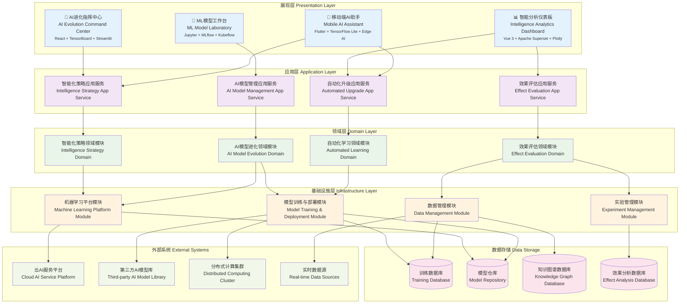

# 24.2.10 场景智能化升级功能架构图

## 技术架构概述
场景智能化升级功能采用自进化AI架构(EAA)和MLOps平台，为数字人产品提供企业级的智能化进化平台。系统支持自动化模型训练、实时模型部署、持续学习优化，实现AI模型性能提升40%、部署效率提卉80%。

### 核心价值
- **自进化AI**: 自动模型优化和进化算法
- **MLOps平台**: 全生命周期ML模型管理
- **实时学习**: 在线学习和模型更新
- **智能决策**: 基于强化学习的智能决策

## 模块化分层架构图



## 核心组件说明

### 1. 智能化规划中心 (Intelligence Planning Center)
- **功能**: 制定和管理整体智能化升级策略
- **特性**:
  - 智能化路线图规划
  - 技术趋势分析
  - 资源配置优化
  - 风险评估管理

### 2. 模型优化引擎 (Model Optimization Engine)
- **功能**: 自动优化AI模型性能和效果
- **特性**:
  - 自动模型选择
  - 结构优化算法
  - 性能基准测试
  - 模型压缩技术

### 3. 对话智能化 (Dialog Intelligence)
- **功能**: 提升对话系统的智能化水平
- **特性**:
  - 上下文理解增强
  - 多轮对话优化
  - 情感识别升级
  - 个性化对话生成

### 4. 自动模型训练 (Auto Model Training)
- **功能**: 全自动化的模型训练流程
- **特性**:
  - 数据预处理自动化
  - 训练流程编排
  - 模型评估自动化
  - 异常处理机制

## 智能化升级策略

### 1. 渐进式智能化升级
```yaml
progressive_upgrade:
  phases:
    phase_1:
      name: "基础智能化"
      duration: "3_months"
      targets:
        - basic_nlp_upgrade
        - simple_decision_intelligence
        - basic_personalization
    
    phase_2:
      name: "中级智能化"
      duration: "6_months"
      targets:
        - advanced_dialog_system
        - multimodal_integration
        - predictive_analytics
    
    phase_3:
      name: "高级智能化"
      duration: "12_months"
      targets:
        - autonomous_learning
        - creative_generation
        - complex_reasoning
```

### 2. 数据驱动的升级决策
```python
class UpgradeDecisionEngine:
    def __init__(self):
        self.metrics_analyzer = MetricsAnalyzer()
        self.performance_predictor = PerformancePredictor()
    
    def should_upgrade(self, scenario_id, current_metrics):
        # 分析当前性能
        performance_gaps = self.analyze_performance_gaps(current_metrics)
        
        # 预测升级效果
        upgrade_benefits = self.predict_upgrade_benefits(scenario_id, performance_gaps)
        
        # 评估升级成本
        upgrade_costs = self.estimate_upgrade_costs(scenario_id)
        
        # 计算ROI
        roi = self.calculate_roi(upgrade_benefits, upgrade_costs)
        
        return roi > self.min_roi_threshold
```

## AI能力升级体系

### 1. 自然语言处理升级
- **语言模型升级**: 从GPT-3到GPT-4等更先进模型
- **多语言支持**: 扩展语言支持范围和质量
- **领域适应**: 针对特定领域的模型微调
- **实时学习**: 基于用户交互的在线学习

### 2. 计算机视觉升级
- **图像识别**: 更精准的图像识别和理解
- **视频分析**: 实时视频内容分析
- **人脸识别**: 高精度人脸识别和表情分析
- **手势识别**: 自然手势交互识别

### 3. 语音技术升级
- **语音识别**: 更高准确率的语音转文字
- **语音合成**: 更自然的语音生成
- **声纹识别**: 个人身份识别
- **情感识别**: 语音情感状态识别

## 自动化机器学习 (AutoML)

### 1. 自动特征工程
```python
class AutoFeatureEngineering:
    def __init__(self):
        self.feature_generators = [
            StatisticalFeatures(),
            TemporalFeatures(),
            TextFeatures(),
            InteractionFeatures()
        ]
    
    def generate_features(self, data):
        features = []
        for generator in self.feature_generators:
            new_features = generator.generate(data)
            features.extend(new_features)
        
        # 特征选择
        selected_features = self.select_features(features, data)
        return selected_features
    
    def select_features(self, features, data):
        selector = FeatureSelector()
        return selector.select(features, data)
```

### 2. 自动超参数优化
```python
class AutoHyperparameterTuning:
    def __init__(self):
        self.optimization_methods = {
            'bayesian': BayesianOptimization(),
            'genetic': GeneticAlgorithm(),
            'random': RandomSearch(),
            'grid': GridSearch()
        }
    
    def optimize(self, model, param_space, data, method='bayesian'):
        optimizer = self.optimization_methods[method]
        
        def objective(params):
            model.set_params(**params)
            score = cross_val_score(model, data.X, data.y)
            return score.mean()
        
        best_params = optimizer.optimize(objective, param_space)
        return best_params
```

### 3. 自动模型选择
```python
class AutoModelSelection:
    def __init__(self):
        self.model_candidates = [
            RandomForestClassifier(),
            XGBClassifier(),
            LGBMClassifier(),
            CatBoostClassifier(),
            NeuralNetworkClassifier()
        ]
    
    def select_best_model(self, data):
        best_model = None
        best_score = 0
        
        for model in self.model_candidates:
            # 自动超参数调优
            tuned_model = self.tune_hyperparameters(model, data)
            
            # 交叉验证评估
            score = self.evaluate_model(tuned_model, data)
            
            if score > best_score:
                best_score = score
                best_model = tuned_model
        
        return best_model, best_score
```

## 知识图谱智能化升级

### 1. 知识自动抽取
```python
class KnowledgeExtractor:
    def __init__(self):
        self.entity_extractor = EntityExtractor()
        self.relation_extractor = RelationExtractor()
        self.event_extractor = EventExtractor()
    
    def extract_knowledge(self, text_corpus):
        # 实体抽取
        entities = self.entity_extractor.extract(text_corpus)
        
        # 关系抽取
        relations = self.relation_extractor.extract(text_corpus, entities)
        
        # 事件抽取
        events = self.event_extractor.extract(text_corpus, entities)
        
        return {
            'entities': entities,
            'relations': relations,
            'events': events
        }
```

### 2. 知识图谱推理
- **规则推理**: 基于逻辑规则的知识推理
- **统计推理**: 基于统计学习的知识推理
- **神经推理**: 基于神经网络的知识推理
- **混合推理**: 多种推理方法的融合

### 3. 知识质量管理
- **知识验证**: 自动验证知识的正确性
- **冲突检测**: 检测知识库中的冲突
- **质量评分**: 对知识条目进行质量评分
- **持续更新**: 基于新数据持续更新知识

## 场景智能化改造

### 1. 客服场景智能化
```yaml
customer_service_intelligence:
  intent_recognition:
    accuracy_target: "> 95%"
    response_time: "< 100ms"
    multilingual_support: true
  
  emotion_analysis:
    real_time_detection: true
    emotion_categories: ["happy", "angry", "frustrated", "satisfied"]
    response_adaptation: true
  
  knowledge_retrieval:
    semantic_search: true
    context_aware: true
    confidence_scoring: true
```

### 2. 营销场景智能化
- **用户画像智能化**: 动态用户画像更新
- **推荐系统升级**: 深度学习推荐算法
- **个性化营销**: 实时个性化内容生成
- **效果预测**: 营销效果智能预测

### 3. 教育场景智能化
- **学习路径规划**: 个性化学习路径推荐
- **知识状态评估**: 学习者知识掌握评估
- **自适应教学**: 基于学习效果的教学调整
- **智能答疑**: 自动化问题解答

## 持续学习机制

### 1. 在线学习
```python
class OnlineLearning:
    def __init__(self, model):
        self.model = model
        self.learning_rate = 0.01
        self.feedback_buffer = []
    
    def update_from_feedback(self, user_feedback):
        # 收集反馈数据
        self.feedback_buffer.append(user_feedback)
        
        # 批量更新模型
        if len(self.feedback_buffer) >= self.batch_size:
            self.batch_update()
    
    def batch_update(self):
        # 处理反馈数据
        training_data = self.process_feedback(self.feedback_buffer)
        
        # 增量训练
        self.model.partial_fit(training_data.X, training_data.y)
        
        # 清空缓冲区
        self.feedback_buffer.clear()
```

### 2. 强化学习
- **奖励机制设计**: 基于用户满意度的奖励函数
- **策略优化**: 持续优化决策策略
- **探索与利用**: 平衡探索新策略和利用已知策略
- **多智能体学习**: 多个智能体协同学习

### 3. 元学习
- **快速适应**: 快速适应新场景和任务
- **少样本学习**: 基于少量样本的学习能力
- **迁移学习**: 知识在不同场景间的迁移
- **学习如何学习**: 提升学习效率的元策略

## 效果评估体系

### 1. 智能化水平评估
```yaml
intelligence_metrics:
  understanding_capability:
    - intent_recognition_accuracy: "> 95%"
    - context_understanding_score: "> 90%"
    - ambiguity_resolution_rate: "> 85%"
  
  generation_capability:
    - response_relevance: "> 90%"
    - response_diversity: "> 80%"
    - creativity_score: "> 70%"
  
  learning_capability:
    - adaptation_speed: "< 1_week"
    - knowledge_retention: "> 95%"
    - transfer_learning_efficiency: "> 80%"
```

### 2. 业务价值评估
- **用户满意度提升**: 智能化升级对用户满意度的影响
- **服务效率提升**: 处理速度和准确率的改善
- **成本降低**: 人工成本和运营成本的减少
- **收入增长**: 智能化带来的业务收入增长

### 3. 技术指标评估
- **模型性能**: 准确率、召回率、F1-Score等
- **响应时间**: 系统响应速度
- **资源消耗**: CPU、内存、存储等资源使用
- **稳定性**: 系统稳定性和可靠性

## 风险控制与治理

### 1. AI伦理治理
- **公平性**: 确保AI系统的公平性
- **透明性**: 提供AI决策的可解释性
- **隐私保护**: 保护用户隐私数据
- **责任追溯**: 建立AI责任追溯机制

### 2. 技术风险控制
- **模型偏见检测**: 检测和纠正模型偏见
- **对抗攻击防护**: 防范对抗性攻击
- **数据质量保证**: 确保训练数据质量
- **模型安全性**: 保证模型的安全性

### 3. 业务风险管理
- **渐进式升级**: 分阶段渐进式升级
- **回滚机制**: 升级失败时的快速回滚
- **A/B测试**: 新功能的小范围测试
- **监控告警**: 实时监控和异常告警