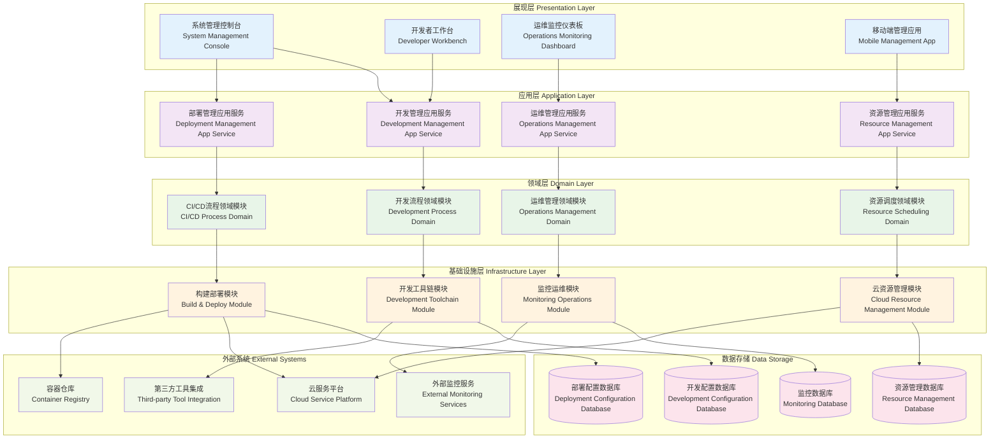

# 24.2.11 系统建设能力功能架构图

## 技术架构概述
系统建设能力功能为数字人产品提供完整的系统构建、部署、运维和管理能力，支持从开发到生产的全生命周期管理，确保系统的可扩展性、可维护性和高可用性。

## 模块化分层架构图



## 核心组件说明

### 1. 低代码开发平台 (Low-Code Platform)
- **功能**: 提供可视化的应用开发能力
- **特性**:
  - 拖拽式界面设计
  - 可视化业务流程编排
  - 代码自动生成
  - 快速原型开发

### 2. CI/CD流水线 (CI/CD Pipeline)
- **功能**: 自动化的持续集成和持续部署
- **特性**:
  - 代码自动构建
  - 自动化测试执行
  - 多环境部署
  - 部署回滚机制

### 3. 系统监控平台 (System Monitoring)
- **功能**: 全方位的系统运行监控
- **特性**:
  - 实时性能监控
  - 资源使用监控
  - 业务指标监控
  - 告警通知机制

### 4. 云资源管理 (Cloud Resource Management)
- **功能**: 统一管理云计算资源
- **特性**:
  - 多云资源管理
  - 资源成本优化
  - 资源使用分析
  - 自动化资源调度

## 开发能力体系

### 1. 低代码开发框架
```yaml
low_code_framework:
  ui_components:
    - form_builder: "表单构建器"
    - chart_builder: "图表构建器"
    - table_builder: "表格构建器"
    - workflow_builder: "流程构建器"
  
  business_logic:
    - rule_engine: "规则引擎"
    - data_processor: "数据处理器"
    - api_connector: "API连接器"
    - event_handler: "事件处理器"
  
  integration:
    - database_connector: "数据库连接器"
    - third_party_api: "第三方API集成"
    - message_queue: "消息队列集成"
    - file_storage: "文件存储集成"
```

### 2. 组件化开发
```python
class ComponentRegistry:
    def __init__(self):
        self.components = {}
        self.component_metadata = {}
    
    def register_component(self, name, component_class, metadata):
        self.components[name] = component_class
        self.component_metadata[name] = metadata
    
    def get_component(self, name):
        if name in self.components:
            return self.components[name]
        raise ComponentNotFoundError(f"Component {name} not found")
    
    def list_components(self, category=None):
        if category:
            return [name for name, meta in self.component_metadata.items() 
                   if meta.get('category') == category]
        return list(self.components.keys())
```

### 3. API管理能力
- **API设计**: RESTful API设计规范
- **API文档**: 自动生成API文档
- **API测试**: 自动化API测试
- **API版本管理**: API版本控制和兼容性管理

## 构建部署体系

### 1. 容器化部署
```dockerfile
# 多阶段构建示例
FROM node:16-alpine AS builder
WORKDIR /app
COPY package*.json ./
RUN npm ci --only=production

FROM node:16-alpine AS runtime
WORKDIR /app
COPY --from=builder /app/node_modules ./node_modules
COPY . .
EXPOSE 3000
CMD ["npm", "start"]
```

### 2. 微服务治理
```yaml
microservice_governance:
  service_discovery:
    - consul: "服务注册与发现"
    - etcd: "配置管理"
  
  load_balancing:
    - nginx: "七层负载均衡"
    - haproxy: "四层负载均衡"
  
  circuit_breaker:
    - hystrix: "熔断器"
    - sentinel: "流量控制"
  
  monitoring:
    - prometheus: "指标收集"
    - grafana: "可视化监控"
```

### 3. 配置管理
```python
class ConfigurationManager:
    def __init__(self):
        self.config_sources = []
        self.config_cache = {}
    
    def add_source(self, source):
        self.config_sources.append(source)
    
    def get_config(self, key, default=None):
        if key in self.config_cache:
            return self.config_cache[key]
        
        for source in self.config_sources:
            value = source.get(key)
            if value is not None:
                self.config_cache[key] = value
                return value
        
        return default
    
    def refresh_config(self):
        self.config_cache.clear()
        for source in self.config_sources:
            source.refresh()
```

## 运维监控体系

### 1. 全链路监控
```yaml
monitoring_stack:
  metrics:
    - prometheus: "指标收集"
    - influxdb: "时序数据库"
  
  logging:
    - elasticsearch: "日志存储"
    - logstash: "日志处理"
    - kibana: "日志可视化"
  
  tracing:
    - jaeger: "分布式追踪"
    - zipkin: "链路追踪"
  
  alerting:
    - alertmanager: "告警管理"
    - pagerduty: "告警通知"
```

### 2. 性能监控指标
```python
class PerformanceMonitor:
    def __init__(self):
        self.metrics = {
            'response_time': [],
            'throughput': [],
            'error_rate': [],
            'cpu_usage': [],
            'memory_usage': []
        }
    
    def record_metric(self, metric_name, value, timestamp=None):
        if timestamp is None:
            timestamp = time.time()
        
        if metric_name in self.metrics:
            self.metrics[metric_name].append({
                'value': value,
                'timestamp': timestamp
            })
    
    def get_metrics_summary(self, metric_name, time_range='1h'):
        data = self.metrics.get(metric_name, [])
        # 计算统计指标
        return {
            'avg': self.calculate_average(data, time_range),
            'max': self.calculate_max(data, time_range),
            'min': self.calculate_min(data, time_range),
            'p95': self.calculate_percentile(data, 95, time_range)
        }
```

### 3. 故障自动化处理
- **故障检测**: 基于规则和机器学习的故障检测
- **故障定位**: 自动化故障根因分析
- **故障恢复**: 自动化故障恢复流程
- **故障预防**: 基于历史数据的故障预防

## 资源管理体系

### 1. 弹性伸缩策略
```yaml
auto_scaling:
  horizontal_scaling:
    - min_replicas: 2
    - max_replicas: 100
    - target_cpu_utilization: 70
    - target_memory_utilization: 80
  
  vertical_scaling:
    - cpu_request: "100m"
    - cpu_limit: "1000m"
    - memory_request: "128Mi"
    - memory_limit: "1Gi"
  
  scaling_policies:
    - scale_up_cooldown: "300s"
    - scale_down_cooldown: "600s"
    - scale_up_step: 2
    - scale_down_step: 1
```

### 2. 资源优化算法
```python
class ResourceOptimizer:
    def __init__(self):
        self.resource_history = {}
        self.cost_model = CostModel()
    
    def optimize_resources(self, service_name):
        # 分析历史资源使用情况
        usage_pattern = self.analyze_usage_pattern(service_name)
        
        # 预测未来资源需求
        future_demand = self.predict_demand(usage_pattern)
        
        # 优化资源配置
        optimal_config = self.calculate_optimal_config(future_demand)
        
        return optimal_config
    
    def calculate_cost_savings(self, current_config, optimal_config):
        current_cost = self.cost_model.calculate_cost(current_config)
        optimal_cost = self.cost_model.calculate_cost(optimal_config)
        return current_cost - optimal_cost
```

### 3. 多云管理
- **云资源统一管理**: 统一管理多个云平台资源
- **成本优化**: 跨云成本比较和优化
- **灾难恢复**: 多云环境下的灾难恢复
- **合规管理**: 多云环境合规性管理

## 安全治理体系

### 1. DevSecOps集成
```yaml
devsecops_pipeline:
  code_analysis:
    - sonarqube: "代码质量分析"
    - checkmarx: "安全漏洞扫描"
  
  dependency_check:
    - snyk: "依赖漏洞检查"
    - whitesource: "开源组件安全"
  
  container_security:
    - twistlock: "容器安全扫描"
    - aqua: "运行时保护"
  
  infrastructure_security:
    - terraform_scan: "基础设施安全"
    - cloud_security: "云安全配置"
```

### 2. 安全策略管理
```python
class SecurityPolicyEngine:
    def __init__(self):
        self.policies = {}
        self.policy_evaluator = PolicyEvaluator()
    
    def add_policy(self, policy_name, policy_rules):
        self.policies[policy_name] = policy_rules
    
    def evaluate_request(self, request):
        violations = []
        
        for policy_name, rules in self.policies.items():
            result = self.policy_evaluator.evaluate(rules, request)
            if not result.is_compliant:
                violations.append({
                    'policy': policy_name,
                    'violation': result.violation_reason
                })
        
        return SecurityEvaluationResult(
            is_allowed=len(violations) == 0,
            violations=violations
        )
```

### 3. 合规性管理
- **合规框架**: 支持多种合规标准（SOC2、ISO27001等）
- **自动化检查**: 自动化合规性检查和报告
- **证据收集**: 合规证据自动收集和归档
- **审计支持**: 提供审计所需的完整文档

## 数据管理体系

### 1. 数据生命周期管理
```yaml
data_lifecycle:
  data_classification:
    - public: "公开数据"
    - internal: "内部数据"
    - confidential: "机密数据"
    - restricted: "限制数据"
  
  retention_policies:
    - log_data: "1_year"
    - user_data: "7_years"
    - transaction_data: "10_years"
    - audit_data: "permanent"
  
  backup_strategies:
    - full_backup: "weekly"
    - incremental_backup: "daily"
    - transaction_log_backup: "hourly"
```

### 2. 数据库管理
```python
class DatabaseManager:
    def __init__(self):
        self.connections = {}
        self.migration_manager = MigrationManager()
    
    def create_connection(self, db_name, config):
        connection = DatabaseConnection(config)
        self.connections[db_name] = connection
        return connection
    
    def execute_migration(self, db_name, migration_script):
        connection = self.connections[db_name]
        return self.migration_manager.execute(connection, migration_script)
    
    def backup_database(self, db_name, backup_path):
        connection = self.connections[db_name]
        backup_manager = BackupManager(connection)
        return backup_manager.create_backup(backup_path)
```

### 3. 数据质量管理
- **数据验证**: 自动化数据质量检查
- **数据清洗**: 数据清洗和标准化
- **数据血缘**: 数据血缘关系追踪
- **数据治理**: 数据治理策略执行

## 系统集成能力

### 1. API集成管理
- **API网关**: 统一API入口管理
- **服务编排**: 微服务编排和组合
- **协议转换**: 多种协议间的转换
- **限流熔断**: API访问控制和保护

### 2. 消息队列管理
```python
class MessageQueueManager:
    def __init__(self):
        self.producers = {}
        self.consumers = {}
        self.topics = {}
    
    def create_producer(self, topic, config):
        producer = MessageProducer(topic, config)
        self.producers[topic] = producer
        return producer
    
    def create_consumer(self, topic, consumer_group, handler):
        consumer = MessageConsumer(topic, consumer_group, handler)
        self.consumers[f"{topic}_{consumer_group}"] = consumer
        return consumer
    
    def send_message(self, topic, message):
        if topic in self.producers:
            return self.producers[topic].send(message)
        raise TopicNotFoundError(f"Topic {topic} not found")
```

### 3. 第三方系统集成
- **CRM系统集成**: 客户关系管理系统对接
- **ERP系统集成**: 企业资源规划系统集成
- **支付系统集成**: 第三方支付平台对接
- **物流系统集成**: 物流跟踪系统集成

## 运维自动化

### 1. 自动化运维脚本
```bash
#!/bin/bash
# 应用部署脚本
deploy_application() {
    local app_name=$1
    local version=$2
    local environment=$3
    
    echo "Deploying $app_name:$version to $environment"
    
    # 停止旧版本
    kubectl scale deployment $app_name --replicas=0 -n $environment
    
    # 更新镜像
    kubectl set image deployment/$app_name container=$app_name:$version -n $environment
    
    # 启动新版本
    kubectl scale deployment $app_name --replicas=3 -n $environment
    
    # 健康检查
    kubectl rollout status deployment/$app_name -n $environment
}
```

### 2. 运维工具链
- **Ansible**: 配置管理和自动化
- **Terraform**: 基础设施即代码
- **Kubernetes**: 容器编排和管理
- **Helm**: Kubernetes应用包管理

### 3. 运维最佳实践
- **GitOps**: 基于Git的运维流程
- **Infrastructure as Code**: 基础设施代码化
- **Immutable Infrastructure**: 不可变基础设施
- **Blue-Green Deployment**: 蓝绿部署策略

## 质量保障体系

### 1. 测试自动化
```python
class TestAutomation:
    def __init__(self):
        self.test_suites = {}
        self.test_results = {}
    
    def add_test_suite(self, suite_name, test_cases):
        self.test_suites[suite_name] = test_cases
    
    def run_tests(self, suite_name=None):
        if suite_name:
            return self.execute_suite(suite_name)
        
        results = {}
        for name, suite in self.test_suites.items():
            results[name] = self.execute_suite(name)
        
        return results
    
    def execute_suite(self, suite_name):
        suite = self.test_suites[suite_name]
        results = []
        
        for test_case in suite:
            result = test_case.execute()
            results.append(result)
        
        return TestSuiteResult(suite_name, results)
```

### 2. 代码质量管理
- **代码审查**: 自动化代码审查流程
- **静态分析**: 代码静态分析和检查
- **测试覆盖率**: 代码测试覆盖率监控
- **技术债务**: 技术债务识别和管理

### 3. 发布质量控制
- **发布门禁**: 发布前质量检查
- **灰度发布**: 渐进式发布策略
- **回滚机制**: 快速回滚能力
- **发布监控**: 发布过程实时监控