# 24.2.1 模版及基础信息配置管理功能架构图

## 技术架构概述
模版及基础信息配置管理功能采用企业级模块化分层架构，为数字人产品提供统一、高效、可扩展的模版管理和配置能力。系统支持多维度配置管理、全生命周期版本控制、实时预览及智能化配置推荐。

### 核心价值
- **统一管理**: 集中化的模版和配置管理平台
- **版本控制**: Git风格的版本管理和协作机制
- **实时预览**: 所见即所得的配置预览体验
- **智能化**: AI驱动的配置优化和异常检测

## 模块化分层架构图

```mermaid
graph TB
    subgraph "展现层 Presentation Layer"
        A[🖥️ Web管理控制台<br/>Web Admin Console<br/><small>React 18 + TypeScript</small>]
        B[📱 移动端配置应用<br/>Mobile Config App<br/><small>React Native + Expo</small>]
        C[🌐 API网关<br/>API Gateway<br/><small>Spring Cloud Gateway</small>]
        D[🔍 实时预览平台<br/>Live Preview Platform<br/><small>WebSocket + WebGL</small>]
    end
    
    subgraph "应用层 Application Layer"
        E[📋 模版管理应用服务<br/>Template Management Service<br/><small>Spring Boot 3.x + GraphQL</small>]
        F[⚙️ 配置管理应用服务<br/>Configuration Management Service<br/><small>Spring Boot + Apollo Config</small>]
        G[🔄 版本控制应用服务<br/>Version Control Service<br/><small>JGit + GitLab API</small>]
        H[🔒 权限管理应用服务<br/>Permission Management Service<br/><small>Spring Security + OAuth2</small>]
        I[🤖 智能推荐应用服务<br/>AI Recommendation Service<br/><small>Python + TensorFlow</small>]
    end
    
    subgraph "领域层 Domain Layer"
        J[🎨 模版领域模块<br/>Template Domain<br/><small>DDD + Event Sourcing</small>]
        K[📊 配置领域模块<br/>Configuration Domain<br/><small>CQRS Pattern</small>]
        L[🌳 版本控制领域模块<br/>Version Control Domain<br/><small>Git Workflow Model</small>]
        M[🛡️ 权限控制领域模块<br/>Permission Control Domain<br/><small>RBAC + ABAC Model</small>]
        N[🧠 智能分析领域模块<br/>Intelligence Analysis Domain<br/><small>ML Pipeline</small>]
    end
    
    subgraph "基础设施层 Infrastructure Layer"
        O[💾 数据持久化模块<br/>Data Persistence Module<br/><small>MyBatis-Plus + Sharding-JDBC</small>]
        P[📁 文件存储模块<br/>Distributed File Storage<br/><small>MinIO + CDN</small>]
        Q[⚡ 缓存管理模块<br/>Multi-level Cache Module<br/><small>Redis Cluster + Caffeine</small>]
        R[📡 消息通信模块<br/>Message Communication<br/><small>Apache Kafka + WebSocket</small>]
        S[🔍 搜索引擎模块<br/>Search Engine Module<br/><small>Elasticsearch 8.x</small>]
        T[📊 监控告警模块<br/>Monitoring & Alert Module<br/><small>Micrometer + Prometheus</small>]
    end
    
    subgraph "数据存储 Data Storage"
        U[(📊 业务数据库<br/>Business Database<br/><small>MySQL 8.0 Master-Slave</small>)]
        V[(📁 文件存储<br/>Object Storage<br/><small>MinIO Cluster</small>)]
        W[(⚡ 缓存存储<br/>Cache Storage<br/><small>Redis Sentinel</small>)]
        X[(🔍 搜索存储<br/>Search Storage<br/><small>Elasticsearch Cluster</small>)]
        Y[(📊 时序数据库<br/>Time Series Database<br/><small>InfluxDB</small>)]
    end
    
    subgraph "外部系统 External Systems"
        Z[🌐 全球CDN网络<br/>Global CDN Network<br/><small>CloudFlare + AWS CloudFront</small>]
        AA[📊 数据分析平台<br/>Data Analytics Platform<br/><small>Apache Spark + Flink</small>]
        BB[🔔 通知服务<br/>Notification Service<br/><small>Firebase + APNs + SMS</small>]
        CC[🔍 审计日志服务<br/>Audit Log Service<br/><small>ELK Stack</small>]
        DD[🤖 AI模型服务<br/>AI Model Service<br/><small>TensorFlow Serving</small>]
    end
    
    %% 展现层到应用层
    A -.-> E
    A -.-> F
    A -.-> G
    A -.-> H
    B -.-> E
    B -.-> F
    C -.-> E
    C -.-> F
    C -.-> G
    C -.-> H
    C -.-> I
    D -.-> E
    D -.-> I
    
    %% 应用层到领域层
    E --> J
    F --> K
    G --> L
    H --> M
    I --> N
    
    %% 领域层到基础设施层
    J --> O
    J --> P
    K --> O
    K --> Q
    L --> O
    L --> R
    M --> O
    M --> Q
    N --> S
    N --> T
    
    %% 基础设施层到数据存储
    O --> U
    P --> V
    Q --> W
    R --> U
    S --> X
    T --> Y
    
    %% 基础设施层到外部系统
    P --> Z
    S --> AA
    R --> BB
    T --> CC
    N --> DD
    
    %% 样式定义 - 展现层
    style A fill:#E3F2FD,stroke:#1976D2,stroke-width:2px
    style B fill:#E3F2FD,stroke:#1976D2,stroke-width:2px
    style C fill:#E3F2FD,stroke:#1976D2,stroke-width:2px
    style D fill:#E3F2FD,stroke:#1976D2,stroke-width:2px
    
    %% 应用层
    style E fill:#F3E5F5,stroke:#7B1FA2,stroke-width:2px
    style F fill:#F3E5F5,stroke:#7B1FA2,stroke-width:2px
    style G fill:#F3E5F5,stroke:#7B1FA2,stroke-width:2px
    style H fill:#F3E5F5,stroke:#7B1FA2,stroke-width:2px
    style I fill:#F3E5F5,stroke:#7B1FA2,stroke-width:2px
    
    %% 领域层
    style J fill:#E8F5E8,stroke:#388E3C,stroke-width:2px
    style K fill:#E8F5E8,stroke:#388E3C,stroke-width:2px
    style L fill:#E8F5E8,stroke:#388E3C,stroke-width:2px
    style M fill:#E8F5E8,stroke:#388E3C,stroke-width:2px
    style N fill:#E8F5E8,stroke:#388E3C,stroke-width:2px
    
    %% 基础设施层
    style O fill:#FFF3E0,stroke:#F57C00,stroke-width:2px
    style P fill:#FFF3E0,stroke:#F57C00,stroke-width:2px
    style Q fill:#FFF3E0,stroke:#F57C00,stroke-width:2px
    style R fill:#FFF3E0,stroke:#F57C00,stroke-width:2px
    style S fill:#FFF3E0,stroke:#F57C00,stroke-width:2px
    style T fill:#FFF3E0,stroke:#F57C00,stroke-width:2px
    
    %% 数据存储
    style U fill:#FCE4EC,stroke:#C2185B,stroke-width:2px
    style V fill:#FCE4EC,stroke:#C2185B,stroke-width:2px
    style W fill:#FCE4EC,stroke:#C2185B,stroke-width:2px
    style X fill:#FCE4EC,stroke:#C2185B,stroke-width:2px
    style Y fill:#FCE4EC,stroke:#C2185B,stroke-width:2px
    
    %% 外部系统
    style Z fill:#F1F8E9,stroke:#689F38,stroke-width:2px
    style AA fill:#F1F8E9,stroke:#689F38,stroke-width:2px
    style BB fill:#F1F8E9,stroke:#689F38,stroke-width:2px
    style CC fill:#F1F8E9,stroke:#689F38,stroke-width:2px
    style DD fill:#F1F8E9,stroke:#689F38,stroke-width:2px
```

## 🏗️ 企业级模块化架构说明

### 🖥️ 展现层 (Presentation Layer)
展现层采用现代化前端技术栈，提供多端统一的用户体验：

#### 1. 🖥️ Web管理控制台 (Web Admin Console)
- **职责**: 提供企业级Web端管理界面
- **核心功能**: 
  - 🎨 可视化模版设计器（拖拽式编辑）
  - ⚙️ 多维度配置管理（层级化配置）
  - 👥 细粒度权限控制（RBAC + ABAC）
  - 📊 实时数据监控和分析
- **技术栈**: React 18 + TypeScript + Ant Design Pro
- **性能指标**: 首屏加载 < 2s，交互响应 < 100ms

#### 2. 📱 移动端配置应用 (Mobile Config App)
- **职责**: 移动端轻量化配置管理
- **核心功能**:
  - 📱 响应式配置界面
  - 👀 移动端实时预览
  - 🔄 离线编辑同步
  - 📣 推送通知管理
- **技术栈**: React Native + Expo + Redux Toolkit
- **支持平台**: iOS 13+, Android 8+

#### 3. 🌐 企业级API网关 (Enterprise API Gateway)
- **职责**: 统一API入口和智能路由
- **核心功能**:
  - 🚦 智能负载均衡和熔断
  - 🔐 多层次安全认证（JWT + OAuth2）
  - 📊 API监控和限流控制
  - 🔄 版本管理和灰度发布
- **技术栈**: Spring Cloud Gateway + Redis + Consul
- **性能指标**: 吞吐量 > 10K RPS，延迟 < 10ms

#### 4. 🔍 实时预览平台 (Live Preview Platform)
- **职责**: 所见即所得的实时预览体验
- **核心功能**:
  - ⚡ 毫秒级实时渲染
  - 🎮 交互式效果测试
  - 📱 多设备适配预览
  - 🎬 动画效果模拟
- **技术栈**: WebSocket + WebGL + Three.js
- **性能指标**: 渲染延迟 < 50ms，支持60FPS

### ⚙️ 应用层 (Application Layer)
应用层采用微服务架构，提供高可用的业务服务编排：

#### 1. 📋 模版管理应用服务 (Template Management Service)
- **职责**: 企业级模版生命周期管理
- **核心功能**:
  - 🎨 智能模版设计和生成
  - 📂 多维度分类和标签管理
  - 📊 使用统计和热度分析
  - 🔄 模版版本化和发布管理
- **技术栈**: Spring Boot 3.x + GraphQL + Redis
- **接口规范**: RESTful API + GraphQL Federation
- **性能指标**: 响应时间 < 100ms，并发支持 > 5000

#### 2. ⚙️ 配置管理应用服务 (Configuration Management Service)
- **职责**: 分布式配置管理和治理
- **核心功能**:
  - 🏗️ 层级化配置架构
  - 🔄 配置继承和覆盖机制
  - ⚡ 实时配置推送和生效
  - 🛡️ 配置安全和合规检查
- **技术栈**: Spring Boot + Apollo Config + Nacos
- **接口规范**: RESTful API + Server-Sent Events
- **性能指标**: 配置推送延迟 < 1s，支持10万+节点

#### 3. 🔄 版本控制应用服务 (Version Control Service)
- **职责**: Git风格的版本管理系统
- **核心功能**:
  - 🌳 分支管理和合并策略
  - 📈 版本比较和差异分析
  - 🔙 智能回滚和恢复机制
  - 👥 协作冲突解决
- **技术栈**: JGit + GitLab API + PostgreSQL
- **接口规范**: Git-compatible API + WebHooks
- **性能指标**: 版本操作响应 < 200ms

#### 4. 🔐 权限管理应用服务 (Permission Management Service)
- **职责**: 统一身份认证和授权管理
- **核心功能**:
  - 🔑 多因子身份认证
  - 👥 RBAC + ABAC 权限模型
  - 🚪 单点登录和会话管理
  - 📊 权限审计和合规报告
- **技术栈**: Spring Security + OAuth2 + JWT
- **接口规范**: OAuth2.0 + OpenID Connect
- **性能指标**: 认证响应 < 50ms，支持万级并发

#### 5. 🤖 AI智能推荐服务 (AI Recommendation Service)
- **职责**: 智能化配置推荐和优化
- **核心功能**:
  - 🧠 智能配置推荐
  - 📊 使用模式分析
  - ⚠️ 异常配置检测
  - 🎯 个性化优化建议
- **技术栈**: Python + TensorFlow + Scikit-learn
- **接口规范**: gRPC + RESTful API
- **性能指标**: 推荐响应 < 300ms，准确率 > 85%

### 领域层 (Domain Layer)
领域层包含核心业务逻辑和领域模型：

#### 1. 模版领域模块 (Template Domain Module)
- **职责**: 模版相关的核心业务逻辑
- **实体**: Template, TemplateCategory, TemplateVersion
- **服务**: TemplateValidator, TemplateRenderer, TemplateParser

#### 2. 配置领域模块 (Configuration Domain Module)
- **职责**: 配置管理的核心业务逻辑
- **实体**: Configuration, ConfigItem, ConfigSchema
- **服务**: ConfigValidator, ConfigMerger, ConfigResolver

#### 3. 版本控制领域模块 (Version Control Domain Module)
- **职责**: 版本控制的核心逻辑
- **实体**: Version, VersionBranch, VersionTag
- **服务**: VersionComparator, MergeResolver, ConflictResolver

#### 4. 权限控制领域模块 (Permission Control Domain Module)
- **职责**: 权限管理的核心逻辑
- **实体**: User, Role, Permission, Resource
- **服务**: AuthenticationService, AuthorizationService, PolicyEvaluator

### 基础设施层 (Infrastructure Layer)
基础设施层提供技术基础设施支撑：

#### 1. 数据持久化模块 (Data Persistence Module)
- **职责**: 数据访问和持久化
- **技术**: MyBatis/JPA + 数据库连接池
- **功能**: CRUD操作、事务管理、数据映射

#### 2. 文件存储模块 (File Storage Module)
- **职责**: 文件和二进制数据存储
- **技术**: MinIO/AWS S3 + CDN
- **功能**: 文件上传下载、版本管理、访问控制

#### 3. 缓存管理模块 (Cache Management Module)
- **职责**: 缓存数据管理
- **技术**: Redis Cluster + Caffeine
- **功能**: 多级缓存、缓存更新、过期策略

#### 4. 消息通信模块 (Message Communication Module)
- **职责**: 异步消息通信
- **技术**: Apache Kafka + RabbitMQ
- **功能**: 事件发布订阅、消息路由、可靠传输

## 技术特点

### 高可用性
- 多实例部署，支持负载均衡
- 数据库主从备份
- 缓存机制提升响应速度

### 安全性
- 权限分级管理
- 操作审计日志
- 数据加密存储

### 扩展性
- 微服务架构，模块化设计
- 支持插件化扩展
- API标准化接口

## 数据流程

1. **配置创建流程**
   - 用户通过界面创建配置 → 配置验证 → 存储到配置库 → 版本记录

2. **模版应用流程**
   - 选择模版 → 参数配置 → 模版引擎渲染 → 预览生成 → 应用部署

3. **版本管理流程**
   - 配置变更 → 版本创建 → 差异比较 → 版本发布 → 历史归档