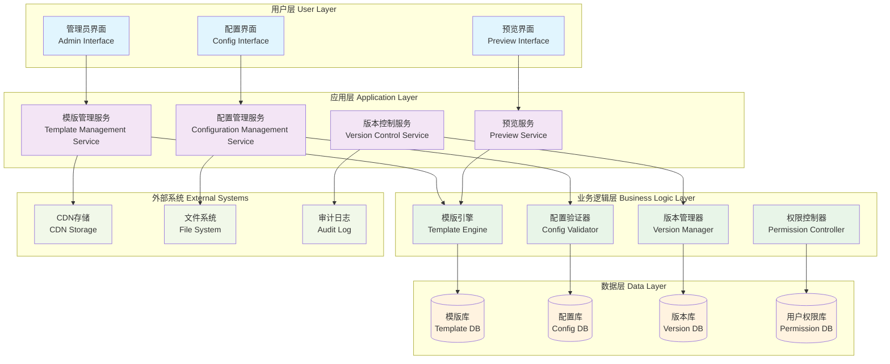

# 24.2.1 模版及基础信息配置管理功能架构图

## 技术架构概述
模版及基础信息配置管理功能为数字人产品提供统一的模版管理和基础配置能力，支持多维度的配置管理和版本控制。

## 架构图

## 核心组件说明

### 1. 模版管理服务 (Template Management Service)
- **功能**: 提供数字人模版的创建、编辑、删除、复制等操作
- **特性**: 
  - 支持多种模版类型（外观、行为、对话等）
  - 模版分类管理和标签系统
  - 模版使用统计和分析

### 2. 配置管理服务 (Configuration Management Service)
- **功能**: 管理数字人的基础配置信息
- **特性**:
  - 层级化配置管理
  - 配置继承和覆盖机制
  - 实时配置生效

### 3. 版本控制服务 (Version Control Service)
- **功能**: 提供配置和模版的版本管理能力
- **特性**:
  - 版本历史追踪
  - 版本比较和回滚
  - 分支管理和合并

### 4. 模版引擎 (Template Engine)
- **功能**: 模版解析和渲染核心引擎
- **特性**:
  - 多格式模版支持
  - 动态参数绑定
  - 缓存优化

## 技术特点

### 高可用性
- 多实例部署，支持负载均衡
- 数据库主从备份
- 缓存机制提升响应速度

### 安全性
- 权限分级管理
- 操作审计日志
- 数据加密存储

### 扩展性
- 微服务架构，模块化设计
- 支持插件化扩展
- API标准化接口

## 数据流程

1. **配置创建流程**
   - 用户通过界面创建配置 → 配置验证 → 存储到配置库 → 版本记录

2. **模版应用流程**
   - 选择模版 → 参数配置 → 模版引擎渲染 → 预览生成 → 应用部署

3. **版本管理流程**
   - 配置变更 → 版本创建 → 差异比较 → 版本发布 → 历史归档