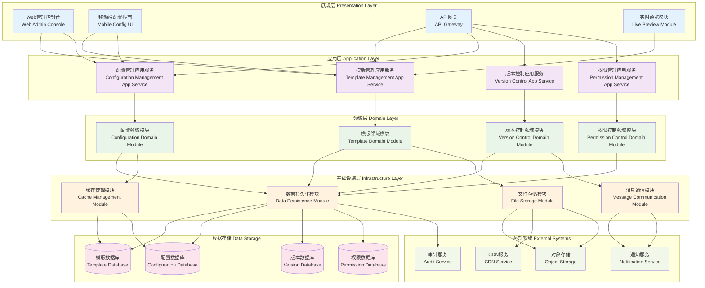

# 24.2.1 模版及基础信息配置管理功能架构图

## 技术架构概述
模版及基础信息配置管理功能采用模块化分层架构，为数字人产品提供统一的模版管理和基础配置能力，支持多维度的配置管理和版本控制。

## 模块化分层架构图

## 模块化架构说明

### 展现层 (Presentation Layer)
展现层负责用户交互和接口暴露，提供多种访问方式：

#### 1. Web管理控制台 (Web Admin Console)
- **职责**: 提供Web端的模版和配置管理界面
- **功能**: 可视化模版编辑、配置管理、权限控制
- **技术**: React/Vue.js + TypeScript

#### 2. 移动端配置界面 (Mobile Config UI)
- **职责**: 移动端的配置管理能力
- **功能**: 移动端模版预览、简单配置修改
- **技术**: React Native/Flutter

#### 3. API网关 (API Gateway)
- **职责**: 统一API入口和路由管理
- **功能**: 请求路由、认证授权、限流熔断
- **技术**: Spring Cloud Gateway/Kong

#### 4. 实时预览模块 (Live Preview Module)
- **职责**: 提供模版和配置的实时预览能力
- **功能**: 实时渲染、效果预览、交互测试
- **技术**: WebSocket + Canvas/WebGL

### 应用层 (Application Layer)
应用层负责业务流程编排和服务协调：

#### 1. 模版管理应用服务 (Template Management App Service)
- **职责**: 模版相关业务流程管理
- **功能**: 模版CRUD、分类管理、使用统计
- **接口**: RESTful API + GraphQL

#### 2. 配置管理应用服务 (Configuration Management App Service)
- **职责**: 配置相关业务流程管理
- **功能**: 配置层级管理、继承机制、生效控制
- **接口**: RESTful API + 事件驱动

#### 3. 版本控制应用服务 (Version Control App Service)
- **职责**: 版本管理业务流程
- **功能**: 版本创建、比较、合并、回滚
- **接口**: Git-like API

#### 4. 权限管理应用服务 (Permission Management App Service)
- **职责**: 权限控制业务流程
- **功能**: 用户认证、权限授权、访问控制
- **接口**: OAuth2.0 + RBAC API

### 领域层 (Domain Layer)
领域层包含核心业务逻辑和领域模型：

#### 1. 模版领域模块 (Template Domain Module)
- **职责**: 模版相关的核心业务逻辑
- **实体**: Template, TemplateCategory, TemplateVersion
- **服务**: TemplateValidator, TemplateRenderer, TemplateParser

#### 2. 配置领域模块 (Configuration Domain Module)
- **职责**: 配置管理的核心业务逻辑
- **实体**: Configuration, ConfigItem, ConfigSchema
- **服务**: ConfigValidator, ConfigMerger, ConfigResolver

#### 3. 版本控制领域模块 (Version Control Domain Module)
- **职责**: 版本控制的核心逻辑
- **实体**: Version, VersionBranch, VersionTag
- **服务**: VersionComparator, MergeResolver, ConflictResolver

#### 4. 权限控制领域模块 (Permission Control Domain Module)
- **职责**: 权限管理的核心逻辑
- **实体**: User, Role, Permission, Resource
- **服务**: AuthenticationService, AuthorizationService, PolicyEvaluator

### 基础设施层 (Infrastructure Layer)
基础设施层提供技术基础设施支撑：

#### 1. 数据持久化模块 (Data Persistence Module)
- **职责**: 数据访问和持久化
- **技术**: MyBatis/JPA + 数据库连接池
- **功能**: CRUD操作、事务管理、数据映射

#### 2. 文件存储模块 (File Storage Module)
- **职责**: 文件和二进制数据存储
- **技术**: MinIO/AWS S3 + CDN
- **功能**: 文件上传下载、版本管理、访问控制

#### 3. 缓存管理模块 (Cache Management Module)
- **职责**: 缓存数据管理
- **技术**: Redis Cluster + Caffeine
- **功能**: 多级缓存、缓存更新、过期策略

#### 4. 消息通信模块 (Message Communication Module)
- **职责**: 异步消息通信
- **技术**: Apache Kafka + RabbitMQ
- **功能**: 事件发布订阅、消息路由、可靠传输

## 技术特点

### 高可用性
- 多实例部署，支持负载均衡
- 数据库主从备份
- 缓存机制提升响应速度

### 安全性
- 权限分级管理
- 操作审计日志
- 数据加密存储

### 扩展性
- 微服务架构，模块化设计
- 支持插件化扩展
- API标准化接口

## 数据流程

1. **配置创建流程**
   - 用户通过界面创建配置 → 配置验证 → 存储到配置库 → 版本记录

2. **模版应用流程**
   - 选择模版 → 参数配置 → 模版引擎渲染 → 预览生成 → 应用部署

3. **版本管理流程**
   - 配置变更 → 版本创建 → 差异比较 → 版本发布 → 历史归档