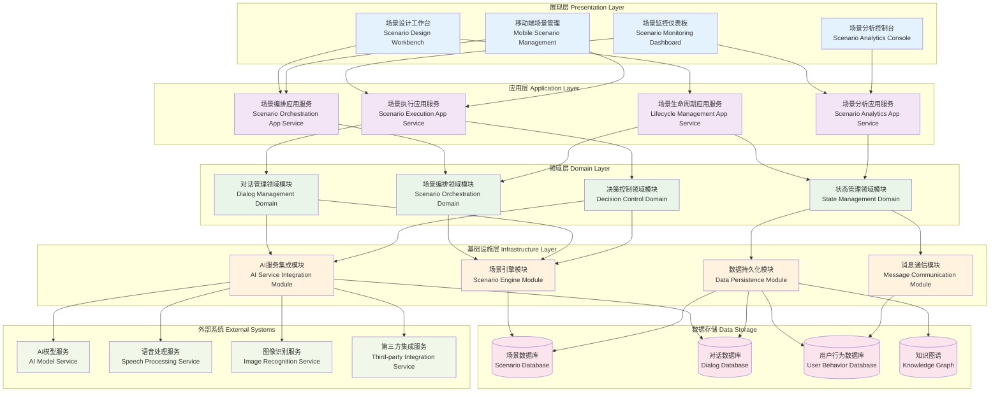

# 24.2.2 场景管理功能架构图

## 技术架构概述
场景管理功能为数字人产品提供全生命周期的场景管理能力，包括场景创建、配置、部署、监控和优化等核心功能。

## 模块化分层架构图

## 核心组件说明

### 1. 场景编排服务 (Scenario Orchestration)
- **功能**: 场景流程的设计和编排
- **特性**:
  - 可视化场景编排界面
  - 条件分支和循环控制
  - 并发场景处理能力
  - 场景模版和复用机制

### 2. 场景生命周期管理 (Lifecycle Management)
- **功能**: 管理场景从创建到销毁的完整生命周期
- **特性**:
  - 场景版本管理
  - 发布和回滚机制
  - A/B测试支持
  - 场景性能监控

### 3. 对话引擎 (Dialog Engine)
- **功能**: 处理数字人的对话逻辑和自然语言理解
- **特性**:
  - 多轮对话管理
  - 意图识别和实体抽取
  - 上下文记忆机制
  - 个性化对话风格

### 4. 决策引擎 (Decision Engine)
- **功能**: 基于规则和机器学习的智能决策
- **特性**:
  - 规则引擎集成
  - 机器学习模型推理
  - 实时决策能力
  - 决策结果追踪

## 技术特点

### 实时性
- 低延迟场景切换
- 实时状态同步
- 流式数据处理

### 智能化
- AI驱动的场景推荐
- 自适应场景优化
- 智能异常处理

### 可扩展性
- 插件化场景组件
- 开放式API接口
- 多云部署支持

## 场景类型支持

### 1. 客服场景
- 问题咨询处理
- 投诉建议处理
- 业务办理引导

### 2. 营销场景
- 产品推荐
- 活动宣传
- 用户画像分析

### 3. 教育场景
- 知识问答
- 学习引导
- 进度跟踪

### 4. 娱乐场景
- 互动游戏
- 内容推荐
- 社交互动

## 数据流程

1. **场景创建流程**
   - 场景设计 → 配置验证 → 场景编译 → 测试验证 → 发布上线

2. **场景执行流程**
   - 用户触发 → 场景路由 → 引擎处理 → 状态更新 → 结果返回

3. **场景优化流程**
   - 数据收集 → 性能分析 → 策略调整 → A/B测试 → 效果评估