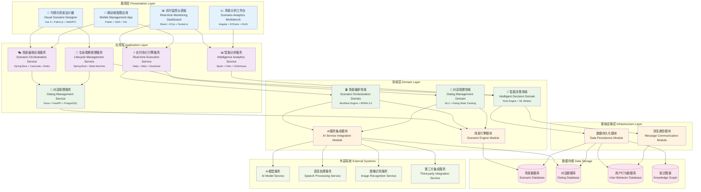

# 24.2.2 场景管理功能架构图

## 技术架构概述
场景管理功能采用事件驱动架构(EDA)和领域驱动设计(DDD)，为数字人产品提供企业级的场景全生命周期管理能力。系统支持可视化场景编排、智能对话管理、实时性能监控和自动化优化。

### 核心价值
- **可视化编排**: 拖拽式场景设计器，低代码开发
- **智能对话**: NLP驱动的多轮对话管理
- **实时执行**: 毫秒级场景响应和状态同步
- **数据驱动**: 基于用户行为的场景优化

## 模块化分层架构图

```mermaid
graph TB
    subgraph "展现层 Presentation Layer"
        A[🎨 可视化场景设计器<br/>Visual Scenario Designer<br/><small>Vue 3 + Fabric.js + WebRTC</small>]
        B[📊 实时监控仪表板<br/>Real-time Monitoring Dashboard<br/><small>React + D3.js + Socket.io</small>]
        C[📈 场景分析工作台<br/>Scenario Analytics Workbench<br/><small>Angular + ECharts + RxJS</small>]
        D[📱 移动端管理应用<br/>Mobile Management App<br/><small>Flutter + GetX + Dio</small>]
    end
    
    subgraph "应用层 Application Layer"
        E[🎭 场景编排应用服务<br/>Scenario Orchestration Service<br/><small>Spring Boot + Camunda + Redis</small>]
        F[🔄 生命周期管理服务<br/>Lifecycle Management Service<br/><small>Spring Boot + State Machine</small>]
        G[⚡ 实时执行引擎服务<br/>Real-time Execution Service<br/><small>Netty + Akka + Hazelcast</small>]
        H[📊 智能分析服务<br/>Intelligence Analytics Service<br/><small>Spark + Flink + ClickHouse</small>]
        I[🤖 对话管理服务<br/>Dialog Management Service<br/><small>Rasa + FastAPI + PostgreSQL</small>]
    end
    
    subgraph "领域层 Domain Layer"
        J[🎬 场景编排领域<br/>Scenario Orchestration Domain<br/><small>Workflow Engine + BPMN 2.0</small>]
        K[💬 对话管理领域<br/>Dialog Management Domain<br/><small>NLU + Dialog State Tracking</small>]
        L[🧠 智能决策领域<br/>Intelligent Decision Domain<br/><small>Rule Engine + ML Models</small>]
        M[🔄 状态管理领域<br/>State Management Domain<br/><small>Event Sourcing + CQRS</small>]
        N[📈 数据分析领域<br/>Data Analytics Domain<br/><small>Stream Processing + OLAP</small>]
    end
    
    subgraph "基础设施层 Infrastructure Layer"
        M[场景引擎模块<br/>Scenario Engine Module]
        N[AI服务集成模块<br/>AI Service Integration Module]
        O[数据持久化模块<br/>Data Persistence Module]
        P[消息通信模块<br/>Message Communication Module]
    end
    
    subgraph "数据存储 Data Storage"
        Q[(场景数据库<br/>Scenario Database)]
        R[(对话数据库<br/>Dialog Database)]
        S[(用户行为数据库<br/>User Behavior Database)]
        T[(知识图谱<br/>Knowledge Graph)]
    end
    
    subgraph "外部系统 External Systems"
        U[AI模型服务<br/>AI Model Service]
        V[语音处理服务<br/>Speech Processing Service]
        W[图像识别服务<br/>Image Recognition Service]
        X[第三方集成服务<br/>Third-party Integration Service]
    end
    
    %% 展现层到应用层
    A --> E
    A --> F
    B --> G
    B --> H
    C --> H
    D --> E
    D --> G
    
    %% 应用层到领域层
    E --> I
    F --> I
    F --> L
    G --> J
    G --> K
    H --> L
    
    %% 领域层到基础设施层
    I --> M
    J --> M
    J --> N
    K --> M
    K --> N
    L --> O
    L --> P
    
    %% 基础设施层到数据存储
    M --> Q
    N --> R
    O --> Q
    O --> R
    O --> S
    O --> T
    P --> S
    
    %% 基础设施层到外部系统
    N --> U
    N --> V
    N --> W
    N --> X
    
    %% 样式定义
    style A fill:#E3F2FD
    style B fill:#E3F2FD
    style C fill:#E3F2FD
    style D fill:#E3F2FD
    style E fill:#F3E5F5
    style F fill:#F3E5F5
    style G fill:#F3E5F5
    style H fill:#F3E5F5
    style I fill:#E8F5E8
    style J fill:#E8F5E8
    style K fill:#E8F5E8
    style L fill:#E8F5E8
    style M fill:#FFF3E0
    style N fill:#FFF3E0
    style O fill:#FFF3E0
    style P fill:#FFF3E0
    style Q fill:#FCE4EC
    style R fill:#FCE4EC
    style S fill:#FCE4EC
    style T fill:#FCE4EC
    style U fill:#F1F8E9
    style V fill:#F1F8E9
    style W fill:#F1F8E9
    style X fill:#F1F8E9
```

## 核心组件说明

### 1. 场景编排服务 (Scenario Orchestration)
- **功能**: 场景流程的设计和编排
- **特性**:
  - 可视化场景编排界面
  - 条件分支和循环控制
  - 并发场景处理能力
  - 场景模版和复用机制

### 2. 场景生命周期管理 (Lifecycle Management)
- **功能**: 管理场景从创建到销毁的完整生命周期
- **特性**:
  - 场景版本管理
  - 发布和回滚机制
  - A/B测试支持
  - 场景性能监控

### 3. 对话引擎 (Dialog Engine)
- **功能**: 处理数字人的对话逻辑和自然语言理解
- **特性**:
  - 多轮对话管理
  - 意图识别和实体抽取
  - 上下文记忆机制
  - 个性化对话风格

### 4. 决策引擎 (Decision Engine)
- **功能**: 基于规则和机器学习的智能决策
- **特性**:
  - 规则引擎集成
  - 机器学习模型推理
  - 实时决策能力
  - 决策结果追踪

## 技术特点

### 实时性
- 低延迟场景切换
- 实时状态同步
- 流式数据处理

### 智能化
- AI驱动的场景推荐
- 自适应场景优化
- 智能异常处理

### 可扩展性
- 插件化场景组件
- 开放式API接口
- 多云部署支持

## 场景类型支持

### 1. 客服场景
- 问题咨询处理
- 投诉建议处理
- 业务办理引导

### 2. 营销场景
- 产品推荐
- 活动宣传
- 用户画像分析

### 3. 教育场景
- 知识问答
- 学习引导
- 进度跟踪

### 4. 娱乐场景
- 互动游戏
- 内容推荐
- 社交互动

## 数据流程

1. **场景创建流程**
   - 场景设计 → 配置验证 → 场景编译 → 测试验证 → 发布上线

2. **场景执行流程**
   - 用户触发 → 场景路由 → 引擎处理 → 状态更新 → 结果返回

3. **场景优化流程**
   - 数据收集 → 性能分析 → 策略调整 → A/B测试 → 效果评估