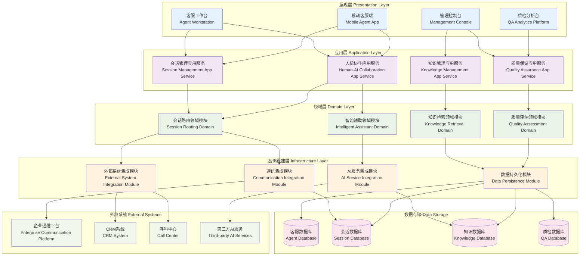

# 24.2.3 真人驱动及客服常用功能建设架构图

## 技术架构概述
真人驱动及客服常用功能建设为数字人产品提供人机协作能力，实现真人客服与数字人的无缝切换，提升客户服务质量和效率。

## 模块化分层架构图



## 核心组件说明

### 1. 会话路由服务 (Session Routing)
- **功能**: 智能分配会话给数字人或真人客服
- **特性**:
  - 基于业务规则的路由策略
  - 客服技能匹配算法
  - 负载均衡和排队管理
  - 优先级处理机制

### 2. 接管管理服务 (Takeover Management)
- **功能**: 管理真人客服接管数字人会话的流程
- **特性**:
  - 无缝会话转移
  - 上下文信息传递
  - 接管触发条件配置
  - 接管历史记录

### 3. 智能推荐引擎 (Recommendation Engine)
- **功能**: 为客服提供智能回复建议和解决方案推荐
- **特性**:
  - 基于历史数据的回复推荐
  - 相似问题匹配
  - 个性化推荐算法
  - 实时学习优化

### 4. 情感分析引擎 (Sentiment Analysis)
- **功能**: 实时分析用户情感状态，辅助客服决策
- **特性**:
  - 多模态情感识别
  - 情感趋势分析
  - 异常情感预警
  - 情感标签自动标注

## 关键功能特性

### 人机协作模式
1. **并行协作**: 数字人和真人同时服务，互相补充
2. **接管模式**: 复杂问题自动转人工处理
3. **辅助模式**: 真人主导，AI提供智能建议
4. **混合模式**: 根据场景动态切换协作方式

### 客服增强功能
1. **智能提示**: 实时提供回复建议和话术推荐
2. **知识检索**: 快速查找相关知识和解决方案
3. **自动摘要**: 会话结束后自动生成摘要报告
4. **质量监控**: 实时监控服务质量和客户满意度

### 多渠道支持
- 网页聊天窗口
- 移动APP内置客服
- 微信公众号/小程序
- 电话语音客服
- 邮件客服系统

## 技术特点

### 实时性能
- 毫秒级会话路由
- 实时状态同步
- 低延迟消息传递

### 智能化程度
- 机器学习驱动的决策
- 自然语言理解
- 个性化服务推荐

### 可扩展性
- 支持大规模并发
- 弹性伸缩能力
- 多租户架构

## 业务流程

### 1. 智能路由流程
```
用户请求 → 意图识别 → 复杂度评估 → 路由决策 → 分配处理
```

### 2. 人工接管流程
```
触发条件 → 接管申请 → 客服分配 → 上下文传递 → 人工处理
```

### 3. 质量监控流程
```
服务过程监控 → 质量指标计算 → 异常检测 → 预警通知 → 改进建议
```

## 性能指标

- **接管响应时间**: < 3秒
- **路由准确率**: > 95%
- **客户满意度**: > 90%
- **首次解决率**: > 80%
- **平均处理时长**: 相比纯人工缩短40%