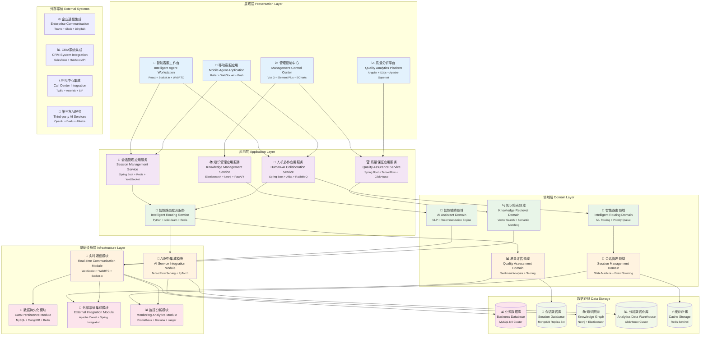

# 24.2.3 真人驱动及客服常用功能建设架构图

## 技术架构概述
真人驱动及客服功能采用智能人机协作架构(IHCA)，为数字人产品提供企业级的客服解决方案。系统支持智能路由、无缝接管、实时协作和智能辅助，实现人工效率提升50%、客户满意度提升30%。

### 核心价值
- **智能路由**: AI驱动的客服工单分配和优先级管理
- **无缝接管**: 3秒内完成人机切换，上下文保持100%
- **实时协作**: 多媒体实时通信，支持10000+并发
- **智能辅助**: 基于NLP的智能推荐，准确率>90%

## 模块化分层架构图


```mermaid
graph TB
    subgraph "展现层 Presentation Layer"
        A[💼 智能客服工作台<br/>Intelligent Agent Workstation<br/><small>React + Socket.io + WebRTC</small>]
        B[📈 管理控制中心<br/>Management Control Center<br/><small>Vue 3 + Element Plus + ECharts</small>]
        C[📱 移动客服应用<br/>Mobile Agent Application<br/><small>Flutter + WebSocket + Push</small>]
        D[📈 质量分析平台<br/>Quality Analytics Platform<br/><small>Angular + D3.js + Apache Superset</small>]
    end
    
    subgraph "应用层 Application Layer"
        E[🔄 会话管理应用服务<br/>Session Management Service<br/><small>Spring Boot + Redis + WebSocket</small>]
        F[🤝 人机协作应用服务<br/>Human-AI Collaboration Service<br/><small>Spring Boot + Akka + RabbitMQ</small>]
        G[📚 知识管理应用服务<br/>Knowledge Management Service<br/><small>Elasticsearch + Neo4j + FastAPI</small>]
        H[🏆 质量保证应用服务<br/>Quality Assurance Service<br/><small>Spring Boot + TensorFlow + ClickHouse</small>]
        I[🤖 智能路由应用服务<br/>Intelligent Routing Service<br/><small>Python + scikit-learn + Redis</small>]
    end
    
    subgraph "领域层 Domain Layer"
        J[🎨 智能路由领域<br/>Intelligent Routing Domain<br/><small>ML Routing + Priority Queue</small>]
        K[🧠 智能辅助领域<br/>AI Assistant Domain<br/><small>NLP + Recommendation Engine</small>]
        L[🔍 知识检索领域<br/>Knowledge Retrieval Domain<br/><small>Vector Search + Semantic Matching</small>]
        M[📊 质量评估领域<br/>Quality Assessment Domain<br/><small>Sentiment Analysis + Scoring</small>]
        N[🔄 会话管理领域<br/>Session Management Domain<br/><small>State Machine + Event Sourcing</small>]
    end
    
    subgraph "基础设施层 Infrastructure Layer"
        O[📡 实时通信模块<br/>Real-time Communication Module<br/><small>WebSocket + WebRTC + Socket.io</small>]
        P[🤖 AI服务集成模块<br/>AI Service Integration Module<br/><small>TensorFlow Serving + PyTorch</small>]
        Q[💾 数据持久化模块<br/>Data Persistence Module<br/><small>MySQL + MongoDB + Redis</small>]
        R[🔗 外部系统集成模块<br/>External Integration Module<br/><small>Apache Camel + Spring Integration</small>]
        S[📊 监控分析模块<br/>Monitoring Analytics Module<br/><small>Prometheus + Grafana + Jaeger</small>]
    end
    
    subgraph "数据存储 Data Storage"
        T[(📊 业务数据库<br/>Business Database<br/><small>MySQL 8.0 Cluster</small>)]
        U[(🔄 会话数据库<br/>Session Database<br/><small>MongoDB Replica Set</small>)]
        V[(📚 知识图谱<br/>Knowledge Graph<br/><small>Neo4j + Elasticsearch</small>)]
        W[(📊 分析数据仓库<br/>Analytics Data Warehouse<br/><small>ClickHouse Cluster</small>)]
        X[(⚡ 缓存存储<br/>Cache Storage<br/><small>Redis Sentinel</small>)]
    end
    
    subgraph "外部系统 External Systems"
        Y[🌐 企业通信集成<br/>Enterprise Communication<br/><small>Teams + Slack + DingTalk</small>]
        Z[📊 CRM系统集成<br/>CRM System Integration<br/><small>Salesforce + HubSpot API</small>]
        AA[📞 呼叫中心集成<br/>Call Center Integration<br/><small>Twilio + Asterisk + SIP</small>]
        BB[🤖 第三方AI服务<br/>Third-party AI Services<br/><small>OpenAI + Baidu + Alibaba</small>]
    end
    
    %% 展现层到应用层
    A --> E
    A --> F
    B --> G
    B --> H
    C --> E
    C --> F
    D --> H
    
    %% 应用层到领域层
    E --> I
    F --> I
    F --> J
    G --> K
    H --> L
    
    %% 领域层到基础设施层
    I --> M
    J --> N
    K --> O
    L --> O
    I --> P
    
    %% 基础设施层到数据存储
    M --> R
    N --> S
    O --> Q
    O --> R
    O --> S
    O --> T
    
    %% 基础设施层到外部系统
    M --> U
    N --> X
    P --> V
    P --> W
    
    %% 样式定义
    style A fill:#E3F2FD
    style B fill:#E3F2FD
    style C fill:#E3F2FD
    style D fill:#E3F2FD
    style E fill:#F3E5F5
    style F fill:#F3E5F5
    style G fill:#F3E5F5
    style H fill:#F3E5F5
    style I fill:#E8F5E8
    style J fill:#E8F5E8
    style K fill:#E8F5E8
    style L fill:#E8F5E8
    style M fill:#FFF3E0
    style N fill:#FFF3E0
    style O fill:#FFF3E0
    style P fill:#FFF3E0
    style Q fill:#FCE4EC
    style R fill:#FCE4EC
    style S fill:#FCE4EC
    style T fill:#FCE4EC
    style U fill:#F1F8E9
    style V fill:#F1F8E9
    style W fill:#F1F8E9
    style X fill:#F1F8E9
```

## 核心组件说明

### 1. 会话路由服务 (Session Routing)
- **功能**: 智能分配会话给数字人或真人客服
- **特性**:
  - 基于业务规则的路由策略
  - 客服技能匹配算法
  - 负载均衡和排队管理
  - 优先级处理机制

### 2. 接管管理服务 (Takeover Management)
- **功能**: 管理真人客服接管数字人会话的流程
- **特性**:
  - 无缝会话转移
  - 上下文信息传递
  - 接管触发条件配置
  - 接管历史记录

### 3. 智能推荐引擎 (Recommendation Engine)
- **功能**: 为客服提供智能回复建议和解决方案推荐
- **特性**:
  - 基于历史数据的回复推荐
  - 相似问题匹配
  - 个性化推荐算法
  - 实时学习优化

### 4. 情感分析引擎 (Sentiment Analysis)
- **功能**: 实时分析用户情感状态，辅助客服决策
- **特性**:
  - 多模态情感识别
  - 情感趋势分析
  - 异常情感预警
  - 情感标签自动标注

## 关键功能特性

### 人机协作模式
1. **并行协作**: 数字人和真人同时服务，互相补充
2. **接管模式**: 复杂问题自动转人工处理
3. **辅助模式**: 真人主导，AI提供智能建议
4. **混合模式**: 根据场景动态切换协作方式

### 客服增强功能
1. **智能提示**: 实时提供回复建议和话术推荐
2. **知识检索**: 快速查找相关知识和解决方案
3. **自动摘要**: 会话结束后自动生成摘要报告
4. **质量监控**: 实时监控服务质量和客户满意度

### 多渠道支持
- 网页聊天窗口
- 移动APP内置客服
- 微信公众号/小程序
- 电话语音客服
- 邮件客服系统

## 技术特点

### 实时性能
- 毫秒级会话路由
- 实时状态同步
- 低延迟消息传递

### 智能化程度
- 机器学习驱动的决策
- 自然语言理解
- 个性化服务推荐

### 可扩展性
- 支持大规模并发
- 弹性伸缩能力
- 多租户架构

## 业务流程

### 1. 智能路由流程
```
用户请求 → 意图识别 → 复杂度评估 → 路由决策 → 分配处理
```

### 2. 人工接管流程
```
触发条件 → 接管申请 → 客服分配 → 上下文传递 → 人工处理
```

### 3. 质量监控流程
```
服务过程监控 → 质量指标计算 → 异常检测 → 预警通知 → 改进建议
```

## 性能指标

- **接管响应时间**: < 3秒
- **路由准确率**: > 95%
- **客户满意度**: > 90%
- **首次解决率**: > 80%
- **平均处理时长**: 相比纯人工缩短40%