# 24.2.4 互动方式与素材配置功能架构图

## 技术架构概述
互动方式与素材配置功能采用多模态融合架构(MFA)和内容分发网络(CDN)，为数字人产品提供下一代交互体验。系统支持VR/AR交互、实时渲染、AI驱动的个性化内容生成，实现用户参与度提升60%、内容交互时间提卅80%。

### 核心价值
- **多模态融合**: 支持语音、视觉、手势、触控的统一交互
- **实时渲染**: 60FPS高清渲染，支持WebGL 2.0
- **智能个性化**: AI驱动的内容推荐，准确率>88%
- **全球分发**: 支持50+国家CDN，平均延迟<100ms

## 模块化分层架构图

```mermaid
graph TB
    subgraph "展现层 Presentation Layer"
        A[🎨 多模态交互设计器<br/>Multimodal Interaction Designer<br/><small>React + Three.js + WebXR</small>]
        B[📁 智能素材管理平台<br/>Smart Material Management<br/><small>Vue 3 + Quasar + WebGL</small>]
        C[🕰️ 实时效果预览器<br/>Real-time Effect Previewer<br/><small>Unity WebGL + WebRTC</small>]
        D[📱 移动端交互应用<br/>Mobile Interaction App<br/><small>React Native + ARCore/ARKit</small>]
    end
    
    subgraph "应用层 Application Layer"
        E[🔄 交互编排应用服务<br/>Interaction Orchestration Service<br/><small>Spring Boot + WebFlux + R2DBC</small>]
        F[🎥 素材管理应用服务<br/>Media Management Service<br/><small>Spring Boot + FFmpeg + ImageMagick</small>]
        G[🤖 个性化推荐服务<br/>Personalization Service<br/><small>Python + TensorFlow + MLflow</small>]
        H[📊 交互分析应用服务<br/>Interaction Analytics Service<br/><small>Scala + Apache Spark + Kafka</small>]
        I[🌎 内容分发应用服务<br/>Content Distribution Service<br/><small>Go + Nginx + Varnish</small>]
    end
    
    subgraph "领域层 Domain Layer"
        J[🔮 多模态融合领域<br/>Multimodal Fusion Domain<br/><small>Sensor Fusion + AI Processing</small>]
        K[🎨 素材处理领域<br/>Media Processing Domain<br/><small>Computer Vision + Audio Processing</small>]
        L[🧠 个性化引擎领域<br/>Personalization Engine Domain<br/><small>Collaborative Filtering + Deep Learning</small>]
        M[🎆 体验优化领域<br/>Experience Optimization Domain<br/><small>A/B Testing + User Journey</small>]
        N[📊 数据洞察领域<br/>Data Insights Domain<br/><small>Real-time Analytics + ML</small>]
    end
    
    subgraph "基础设施层 Infrastructure Layer"
        O[⚡ 高性能交互引擎<br/>High-Performance Interaction Engine<br/><small>C++ + OpenGL + Vulkan</small>]
        P[🎥 媒体处理引擎<br/>Media Processing Engine<br/><small>FFmpeg + OpenCV + CUDA</small>]
        Q[🌍 全球CDN网络<br/>Global CDN Network<br/><small>CloudFlare + AWS + Alibaba</small>]
        R[💾 分布式存储系统<br/>Distributed Storage System<br/><small>Ceph + MinIO + HDFS</small>]
        S[📊 实时数据流<br/>Real-time Data Pipeline<br/><small>Apache Kafka + Flink + Storm</small>]
    end
    
    subgraph "数据存储 Data Storage"
        T[(🎥 媒体资产数据库<br/>Media Asset Database<br/><small>PostgreSQL + PostGIS</small>)]
        U[(⚙️ 交互配置数据库<br/>Interaction Config Database<br/><small>MongoDB Atlas</small>)]
        V[(👤 用户画像数据库<br/>User Profile Database<br/><small>Redis + Cassandra</small>)]
        W[(📊 实时分析数据库<br/>Real-time Analytics DB<br/><small>ClickHouse + TimescaleDB</small>)]
        X[(🔍 搜索索引数据库<br/>Search Index Database<br/><small>Elasticsearch + Solr</small>)]
    end
    
    subgraph "外部系统 External Systems"
        Y[🌐 多云CDN服务<br/>Multi-Cloud CDN Services<br/><small>AWS + Azure + GCP + Alibaba</small>]
        Z[🎨 第三方资产库<br/>Third-party Asset Libraries<br/><small>Getty + Shutterstock + Adobe Stock</small>]
        AA[🤖 AI计算平台<br/>AI Computing Platform<br/><small>NVIDIA DGX + Google TPU</small>]
        BB[📊 数据分析平台<br/>Analytics Platform<br/><small>Google Analytics + Adobe Analytics</small>]
    end
    
    %% 展现层到应用层
    A --> E
    B --> F
    C --> G
    C --> H
    D --> E
    D --> G
    
    %% 应用层到领域层
    E --> I
    F --> J
    G --> K
    H --> L
    
    %% 领域层到基础设施层
    I --> M
    J --> N
    K --> M
    K --> P
    L --> O
    L --> P
    
    %% 基础设施层到数据存储
    M --> R
    N --> Q
    O --> Q
    P --> Q
    P --> R
    P --> S
    P --> T
    
    %% 基础设施层到外部系统
    N --> W
    N --> X
    O --> U
    O --> V
    
    %% 样式定义
    style A fill:#E3F2FD
    style B fill:#E3F2FD
    style C fill:#E3F2FD
    style D fill:#E3F2FD
    style E fill:#F3E5F5
    style F fill:#F3E5F5
    style G fill:#F3E5F5
    style H fill:#F3E5F5
    style I fill:#E8F5E8
    style J fill:#E8F5E8
    style K fill:#E8F5E8
    style L fill:#E8F5E8
    style M fill:#FFF3E0
    style N fill:#FFF3E0
    style O fill:#FFF3E0
    style P fill:#FFF3E0
    style Q fill:#FCE4EC
    style R fill:#FCE4EC
    style S fill:#FCE4EC
    style T fill:#FCE4EC
    style U fill:#F1F8E9
    style V fill:#F1F8E9
    style W fill:#F1F8E9
    style X fill:#F1F8E9
```



## 核心组件说明

### 1. 多模态交互引擎 (Multimodal Engine)
- **功能**: 统一管理文字、语音、视觉、手势等多种交互方式
- **特性**:
  - 多模态融合理解
  - 交互方式自动切换
  - 上下文关联处理
  - 实时交互响应

### 2. 素材转码服务 (Material Transcoding)
- **功能**: 处理各种格式的数字素材，确保兼容性和性能
- **特性**:
  - 多格式支持（图片、视频、音频、3D模型）
  - 自适应转码
  - 质量优化算法
  - 批量处理能力

### 3. 动态渲染服务 (Dynamic Rendering)
- **功能**: 根据用户交互和配置动态生成个性化内容
- **特性**:
  - 实时内容生成
  - 模板化渲染
  - 参数化配置
  - 缓存优化

### 4. 个性化配置 (Personalization Config)
- **功能**: 基于用户行为和偏好提供个性化交互体验
- **特性**:
  - 用户画像分析
  - 个性化推荐算法
  - 动态配置调整
  - 学习优化机制

## 支持的交互方式

### 1. 文字交互
- **基础文字对话**: 支持富文本、表情符号、链接等
- **智能输入提示**: 自动补全、语法纠错、意图识别
- **多语言支持**: 实时翻译、方言识别、语言切换

### 2. 语音交互
- **语音识别**: 支持多种语言和方言的语音转文字
- **语音合成**: 个性化音色、情感表达、语速调节
- **声纹识别**: 用户身份验证、个性化服务

### 3. 视觉交互
- **表情识别**: 情感状态分析、反应生成
- **手势识别**: 手势命令、动作交互
- **眼球追踪**: 注意力分析、界面优化

### 4. 触控交互
- **点击交互**: 按钮、链接、菜单操作
- **滑动手势**: 页面切换、内容浏览
- **多点触控**: 缩放、旋转、多指操作

## 素材类型管理

### 1. 视觉素材
- **静态图片**: JPG、PNG、WebP、SVG等格式支持
- **动态图片**: GIF、APNG动画支持
- **视频内容**: MP4、WebM、AV1编码优化
- **3D模型**: glTF、FBX、OBJ格式支持

### 2. 音频素材
- **背景音乐**: 场景配乐、氛围音效
- **语音素材**: 预录语音、TTS合成音频
- **音效库**: 交互音效、提示音、反馈音

### 3. 交互素材
- **UI组件**: 按钮、表单、弹窗等界面元素
- **动画效果**: 过渡动画、加载动画、交互反馈
- **主题皮肤**: 颜色方案、字体样式、布局模板

## 技术特点

### 高性能处理
- GPU加速渲染
- 多线程并行处理
- 智能缓存策略
- CDN全球分发

### 智能优化
- 自适应质量调整
- 网络状况感知
- 设备性能适配
- 用户偏好学习

### 安全可靠
- 素材版权保护
- 内容安全检测
- 访问权限控制
- 数据加密传输

## 配置管理功能

### 1. 交互配置
```yaml
interaction:
  modes: [text, voice, gesture, touch]
  response_time: 200ms
  fallback_strategy: text
  personalization: enabled
```

### 2. 素材配置
```yaml
materials:
  image:
    formats: [webp, jpg, png]
    quality: adaptive
    lazy_loading: true
  video:
    codec: h264
    resolution: auto
    preload: metadata
```

### 3. 个性化配置
```yaml
personalization:
  user_profiling: enabled
  recommendation: collaborative_filtering
  adaptation_speed: medium
  privacy_level: standard
```

## 性能指标

- **素材加载时间**: < 2秒
- **交互响应延迟**: < 200ms
- **多模态融合准确率**: > 95%
- **个性化推荐点击率**: > 15%
- **CDN命中率**: > 90%