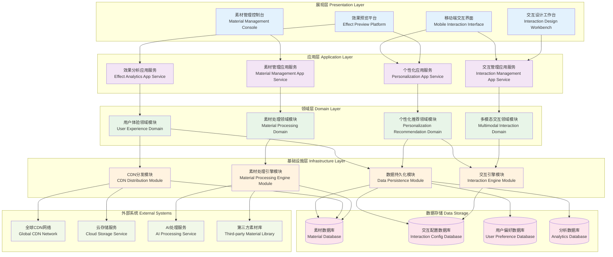

# 24.2.4 互动方式与素材配置功能架构图

## 技术架构概述
互动方式与素材配置功能为数字人产品提供丰富的交互能力和素材管理功能，支持多模态交互和动态素材配置，提升用户体验的丰富性和个性化程度。

## 模块化分层架构图



## 核心组件说明

### 1. 多模态交互引擎 (Multimodal Engine)
- **功能**: 统一管理文字、语音、视觉、手势等多种交互方式
- **特性**:
  - 多模态融合理解
  - 交互方式自动切换
  - 上下文关联处理
  - 实时交互响应

### 2. 素材转码服务 (Material Transcoding)
- **功能**: 处理各种格式的数字素材，确保兼容性和性能
- **特性**:
  - 多格式支持（图片、视频、音频、3D模型）
  - 自适应转码
  - 质量优化算法
  - 批量处理能力

### 3. 动态渲染服务 (Dynamic Rendering)
- **功能**: 根据用户交互和配置动态生成个性化内容
- **特性**:
  - 实时内容生成
  - 模板化渲染
  - 参数化配置
  - 缓存优化

### 4. 个性化配置 (Personalization Config)
- **功能**: 基于用户行为和偏好提供个性化交互体验
- **特性**:
  - 用户画像分析
  - 个性化推荐算法
  - 动态配置调整
  - 学习优化机制

## 支持的交互方式

### 1. 文字交互
- **基础文字对话**: 支持富文本、表情符号、链接等
- **智能输入提示**: 自动补全、语法纠错、意图识别
- **多语言支持**: 实时翻译、方言识别、语言切换

### 2. 语音交互
- **语音识别**: 支持多种语言和方言的语音转文字
- **语音合成**: 个性化音色、情感表达、语速调节
- **声纹识别**: 用户身份验证、个性化服务

### 3. 视觉交互
- **表情识别**: 情感状态分析、反应生成
- **手势识别**: 手势命令、动作交互
- **眼球追踪**: 注意力分析、界面优化

### 4. 触控交互
- **点击交互**: 按钮、链接、菜单操作
- **滑动手势**: 页面切换、内容浏览
- **多点触控**: 缩放、旋转、多指操作

## 素材类型管理

### 1. 视觉素材
- **静态图片**: JPG、PNG、WebP、SVG等格式支持
- **动态图片**: GIF、APNG动画支持
- **视频内容**: MP4、WebM、AV1编码优化
- **3D模型**: glTF、FBX、OBJ格式支持

### 2. 音频素材
- **背景音乐**: 场景配乐、氛围音效
- **语音素材**: 预录语音、TTS合成音频
- **音效库**: 交互音效、提示音、反馈音

### 3. 交互素材
- **UI组件**: 按钮、表单、弹窗等界面元素
- **动画效果**: 过渡动画、加载动画、交互反馈
- **主题皮肤**: 颜色方案、字体样式、布局模板

## 技术特点

### 高性能处理
- GPU加速渲染
- 多线程并行处理
- 智能缓存策略
- CDN全球分发

### 智能优化
- 自适应质量调整
- 网络状况感知
- 设备性能适配
- 用户偏好学习

### 安全可靠
- 素材版权保护
- 内容安全检测
- 访问权限控制
- 数据加密传输

## 配置管理功能

### 1. 交互配置
```yaml
interaction:
  modes: [text, voice, gesture, touch]
  response_time: 200ms
  fallback_strategy: text
  personalization: enabled
```

### 2. 素材配置
```yaml
materials:
  image:
    formats: [webp, jpg, png]
    quality: adaptive
    lazy_loading: true
  video:
    codec: h264
    resolution: auto
    preload: metadata
```

### 3. 个性化配置
```yaml
personalization:
  user_profiling: enabled
  recommendation: collaborative_filtering
  adaptation_speed: medium
  privacy_level: standard
```

## 性能指标

- **素材加载时间**: < 2秒
- **交互响应延迟**: < 200ms
- **多模态融合准确率**: > 95%
- **个性化推荐点击率**: > 15%
- **CDN命中率**: > 90%