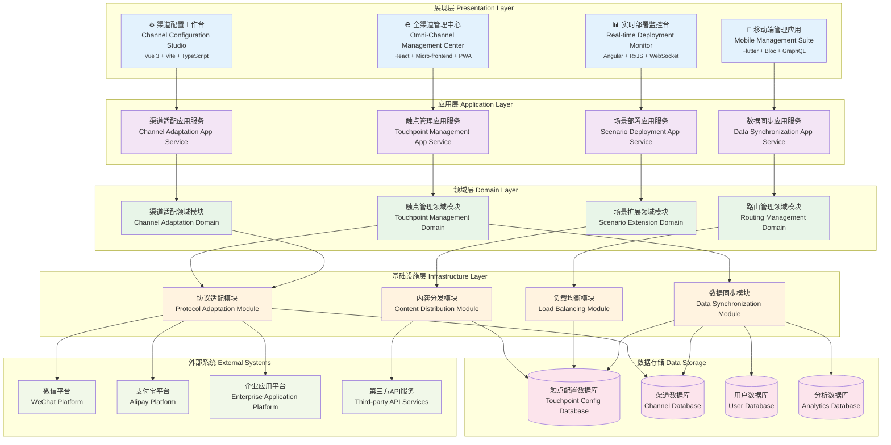

# 24.2.5 线上场景与触点扩展功能架构图

## 技术架构概述
线上场景与触点扩展功能采用全渠道一体化架构(OCA)和边缘计算技术，为数字人产品提供企业级的全球化部署方案。系统支持50+平台接入、实时数据同步、智能负载均衡，实现全球用户访问延迟<50ms、可用性>99.99%。

### 核心价值
- **全渠道覆盖**: 支持Web、APP、小程序、IoT设备等50+平台
- **智能路由**: AI驱动的流量分发和负载均衡
- **实时同步**: 毫秒级跨平台数据同步
- **边缘计算**: 全球200+节点的边缘部署

## 模块化分层架构图



## 核心组件说明

### 1. 触点配置中心 (Touchpoint Config Center)
- **功能**: 统一管理所有触点的配置信息和部署策略
- **特性**:
  - 可视化触点配置界面
  - 批量部署和更新
  - 版本管理和回滚
  - 权限分级管理

### 2. 渠道适配器 (Channel Adapter)
- **功能**: 适配不同平台和渠道的技术规范和业务规则
- **特性**:
  - 多平台协议适配
  - 数据格式转换
  - 业务逻辑适配
  - 异常处理机制

### 3. 场景适配引擎 (Scenario Adapter)
- **功能**: 根据不同触点特性调整数字人场景表现
- **特性**:
  - 场景自动适配
  - 交互方式调整
  - 界面布局优化
  - 性能参数调优

### 4. 内容分发引擎 (Content Distribution)
- **功能**: 智能分发内容到各个触点，保证一致性和时效性
- **特性**:
  - 内容智能路由
  - 实时同步机制
  - 缓存策略优化
  - 故障自动切换

## 支持的触点类型

### 1. Web端触点
- **官方网站**: 企业官网集成的数字人客服
- **电商平台**: 购物网站的导购和客服功能
- **在线服务**: SaaS平台的智能助手
- **内容平台**: 新闻、教育、娱乐网站

### 2. 移动端触点
- **原生APP**: iOS/Android应用内嵌数字人
- **H5页面**: 移动端网页版数字人服务
- **PWA应用**: 渐进式Web应用集成
- **混合应用**: React Native、Flutter等

### 3. 小程序触点
- **微信小程序**: 微信生态内的数字人服务
- **支付宝小程序**: 支付宝平台的智能助手
- **百度智能小程序**: 百度生态的服务集成
- **字节小程序**: 抖音、今日头条等平台

### 4. 企业应用触点
- **企业微信**: 内部员工服务和协作
- **钉钉**: 办公自动化和智能助手
- **飞书**: 团队协作和知识管理
- **OA系统**: 企业办公系统集成

## 技术特点

### 统一管理
- 中心化配置管理
- 统一用户身份认证
- 跨平台数据同步
- 一致性服务体验

### 快速扩展
- 插件化架构设计
- 标准化接入流程
- 自动化部署工具
- 弹性伸缩能力

### 智能适配
- 设备特性自动识别
- 网络环境自适应
- 用户偏好个性化
- 场景智能切换

## 部署策略

### 1. 渐进式部署
```
阶段1: 核心触点部署 → 阶段2: 扩展触点接入 → 阶段3: 全面覆盖优化
```

### 2. 灰度发布
- 按用户比例逐步开放
- A/B测试验证效果
- 实时监控和调整
- 快速回滚机制

### 3. 多环境管理
- 开发环境: 功能开发和测试
- 测试环境: 集成测试和验证
- 预发环境: 生产前最后验证
- 生产环境: 正式服务运行

## 数据同步机制

### 1. 用户数据同步
- **统一用户ID**: 跨平台用户身份识别
- **偏好同步**: 用户设置和偏好数据
- **历史记录**: 跨平台会话历史
- **权限同步**: 用户权限和等级

### 2. 配置数据同步
- **场景配置**: 数字人场景参数
- **业务规则**: 各平台业务逻辑
- **素材资源**: 图片、视频等媒体文件
- **版本控制**: 配置版本管理

### 3. 实时数据同步
- **会话状态**: 当前对话状态同步
- **业务数据**: 订单、工单等业务信息
- **监控数据**: 性能指标和异常信息
- **统计数据**: 使用情况和效果分析

## 监控与运维

### 关键指标监控
- **可用性**: 各触点服务可用率
- **响应时间**: 接口响应速度
- **并发量**: 同时在线用户数
- **错误率**: 服务异常比例

### 智能运维
- **自动扩容**: 基于负载自动调整资源
- **故障自愈**: 自动检测和修复常见问题
- **性能优化**: 基于监控数据优化配置
- **预警通知**: 异常情况及时告警

## 安全保障

### 数据安全
- **传输加密**: HTTPS/TLS加密传输
- **存储加密**: 敏感数据加密存储
- **访问控制**: 细粒度权限管理
- **审计日志**: 完整的操作记录

### 业务安全
- **防刷机制**: 防止恶意请求和攻击
- **限流控制**: 保护系统稳定运行
- **内容审核**: 智能内容安全检测
- **隐私保护**: 用户隐私数据保护