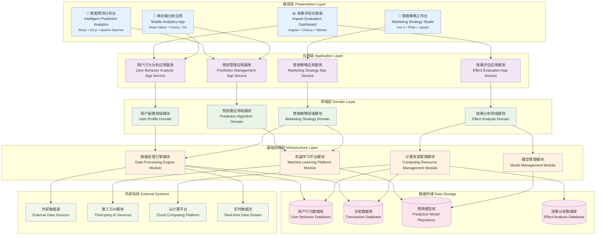

# 24.2.6 服务与营销预测功能架构图

## 技术架构概述
服务与营销预测功能采用实时数据湖架构(RDL)和深度学习平台，为数字人产品提供企业级的智能商业分析平台。系统支持实时流处理、自动化ML流水线、预测模型部署，实现预测准确率>92%、实时响应<100ms。

### 核心价值
- **实时预测**: 毫秒级实时预测，支挀10万+并发请求
- **智能建模**: AutoML自动化模型训练和优化
- **多维分析**: 360度用户画像和行为分析
- **实时决策**: A/B测试和策略优化闭环

## 模块化分层架构图



## 核心组件说明

### 1. 用户行为预测 (User Behavior Prediction)
- **功能**: 预测用户的下一步行为和需求
- **特性**:
  - 行为序列分析
  - 意图识别预测
  - 路径预测算法
  - 个性化行为建模

### 2. 需求预测引擎 (Demand Prediction)
- **功能**: 预测市场需求和业务量变化趋势
- **特性**:
  - 时间序列预测
  - 季节性分析
  - 趋势识别
  - 异常检测

### 3. 转化率预测 (Conversion Prediction)
- **功能**: 预测用户转化概率和营销效果
- **特性**:
  - 转化漏斗分析
  - 多目标预测
  - 实时评分
  - A/B测试支持

### 4. 流失预警引擎 (Churn Warning)
- **功能**: 识别高风险流失用户并提供预警
- **特性**:
  - 流失风险评估
  - 早期预警机制
  - 挽回策略推荐
  - 效果跟踪分析

## 预测模型类型

### 1. 深度学习模型
- **LSTM/GRU**: 用于序列数据预测
- **Transformer**: 处理复杂时序关系
- **CNN**: 图像和文本特征提取
- **AutoEncoder**: 异常检测和降维

### 2. 传统机器学习
- **随机森林**: 特征重要性分析
- **XGBoost**: 结构化数据预测
- **SVM**: 分类和回归任务
- **K-Means**: 用户聚类分析

### 3. 时间序列模型
- **ARIMA**: 经典时序预测
- **Prophet**: 业务时序预测
- **VAR**: 多变量时序分析
- **状态空间模型**: 复杂动态系统

## 应用场景

### 1. 服务预测场景
- **咨询量预测**: 预测各时段的咨询需求
- **服务质量预测**: 预测服务满意度变化
- **资源需求预测**: 预测人力和系统资源需求
- **问题类型预测**: 预测常见问题趋势

### 2. 营销预测场景
- **销售预测**: 预测产品销量和收入
- **用户价值预测**: 预测用户生命周期价值
- **营销ROI预测**: 预测营销活动效果
- **市场趋势预测**: 预测行业发展趋势

### 3. 用户预测场景
- **购买意向预测**: 预测用户购买概率
- **兴趣偏好预测**: 预测用户兴趣变化
- **活跃度预测**: 预测用户活跃程度
- **流失风险预测**: 预测用户流失概率

## 数据特征工程

### 1. 用户特征
```python
user_features = {
    'demographic': ['age', 'gender', 'location', 'occupation'],
    'behavioral': ['visit_frequency', 'session_duration', 'page_views'],
    'transactional': ['purchase_history', 'amount_spent', 'payment_method'],
    'engagement': ['click_rate', 'conversion_rate', 'retention_rate']
}
```

### 2. 时间特征
```python
time_features = {
    'temporal': ['hour', 'day_of_week', 'month', 'quarter'],
    'cyclical': ['is_weekend', 'is_holiday', 'season'],
    'trend': ['days_since_first_visit', 'recency', 'frequency']
}
```

### 3. 交互特征
```python
interaction_features = {
    'cross_features': ['age_x_gender', 'location_x_time'],
    'statistical': ['mean', 'median', 'std', 'percentile'],
    'sequence': ['last_n_actions', 'action_patterns']
}
```

## 实时预测流程

### 1. 数据流处理
```
实时数据 → 特征提取 → 模型推理 → 结果输出 → 决策执行
```

### 2. 批量预测流程
```
历史数据 → 特征工程 → 模型训练 → 批量预测 → 结果存储
```

### 3. 模型更新流程
```
新数据收集 → 模型评估 → 重新训练 → 模型验证 → 模型部署
```

## 效果评估指标

### 1. 预测准确性
- **准确率 (Accuracy)**: 整体预测正确率
- **精确率 (Precision)**: 正例预测准确性
- **召回率 (Recall)**: 正例识别完整性
- **F1-Score**: 精确率和召回率的调和平均

### 2. 业务指标
- **转化提升率**: 预测驱动的转化率提升
- **成本降低率**: 精准预测带来的成本节约
- **收入增长率**: 预测优化带来的收入增长
- **客户满意度**: 预测服务对满意度的影响

### 3. 技术指标
- **预测延迟**: 从数据输入到预测结果的时间
- **模型稳定性**: 预测结果的一致性和可靠性
- **资源消耗**: 预测过程的计算和存储资源使用
- **可解释性**: 预测结果的可理解和可解释程度

## 技术架构特点

### 高性能计算
- 分布式模型训练
- GPU/TPU加速计算
- 内存计算优化
- 并行预测处理

### 实时性保障
- 流式数据处理
- 在线学习能力
- 增量模型更新
- 快速响应机制

### 可扩展性
- 微服务架构
- 容器化部署
- 弹性伸缩
- 插件化扩展

## 风险控制

### 1. 模型风险
- **过拟合控制**: 正则化和交叉验证
- **数据泄露防护**: 时间切分和特征审查
- **模型偏见检测**: 公平性评估和调整
- **预测稳定性**: 模型集成和鲁棒性测试

### 2. 业务风险
- **预测失效监控**: 实时监控预测准确性
- **异常预测处理**: 异常值检测和处理机制
- **业务规则约束**: 预测结果的业务逻辑校验
- **人工审核机制**: 重要预测的人工复核