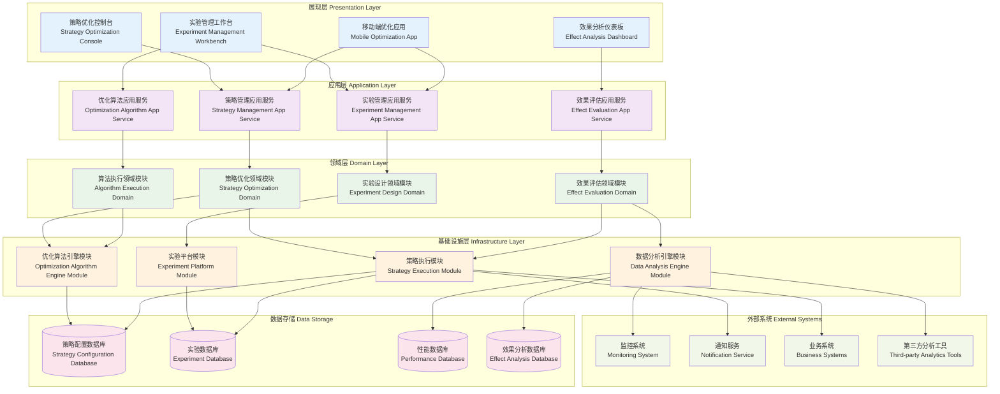

# 24.2.7 定期策略优化功能架构图

## 技术架构概述
定期策略优化功能为数字人产品提供持续改进和自动优化能力，通过数据驱动的方式定期分析系统表现，自动调整策略参数，实现系统性能的持续提升。

## 模块化分层架构图



## 核心组件说明

### 1. 策略配置中心 (Strategy Config Center)
- **功能**: 统一管理所有优化策略的配置和参数
- **特性**:
  - 策略模板管理
  - 参数范围定义
  - 约束条件设置
  - 优化目标配置

### 2. 优化任务调度 (Optimization Scheduler)
- **功能**: 管理和调度各种优化任务的执行
- **特性**:
  - 定时任务调度
  - 优先级管理
  - 资源分配
  - 任务依赖处理

### 3. 性能分析引擎 (Performance Analysis)
- **功能**: 分析系统各项性能指标和趋势
- **特性**:
  - 多维度性能监控
  - 异常检测算法
  - 趋势预测分析
  - 瓶颈识别定位

### 4. 贝叶斯优化 (Bayesian Optimization)
- **功能**: 基于概率模型的全局优化算法
- **特性**:
  - 高效参数搜索
  - 不确定性量化
  - 获取函数优化
  - 少样本优化

## 优化策略类型

### 1. 性能优化策略
- **响应时间优化**: 调整缓存策略、数据库连接池等
- **并发处理优化**: 优化线程池、连接数配置
- **资源利用优化**: CPU、内存、磁盘使用率优化
- **网络传输优化**: 压缩算法、CDN配置优化

### 2. 业务策略优化
- **推荐算法优化**: 推荐模型参数调优
- **定价策略优化**: 动态定价参数优化
- **营销策略优化**: 营销活动参数调整
- **用户体验优化**: 界面布局、交互流程优化

### 3. AI模型优化
- **模型超参数优化**: 学习率、批次大小等参数
- **特征选择优化**: 特征组合和权重调整
- **模型结构优化**: 网络架构自动搜索
- **训练策略优化**: 训练轮次、正则化参数

## 优化算法详解

### 1. 遗传算法 (Genetic Algorithm)
```python
class GeneticOptimizer:
    def __init__(self, population_size=50, generations=100):
        self.population_size = population_size
        self.generations = generations
    
    def optimize(self, objective_function, bounds):
        # 初始化种群
        population = self.initialize_population(bounds)
        
        for generation in range(self.generations):
            # 评估适应度
            fitness = [objective_function(individual) for individual in population]
            
            # 选择、交叉、变异
            population = self.evolve(population, fitness)
        
        return self.best_individual(population, fitness)
```

### 2. 模拟退火 (Simulated Annealing)
```python
class SimulatedAnnealing:
    def __init__(self, initial_temp=1000, cooling_rate=0.95):
        self.initial_temp = initial_temp
        self.cooling_rate = cooling_rate
    
    def optimize(self, objective_function, initial_solution):
        current_solution = initial_solution
        current_cost = objective_function(current_solution)
        temperature = self.initial_temp
        
        while temperature > 0.1:
            # 生成邻域解
            neighbor = self.generate_neighbor(current_solution)
            neighbor_cost = objective_function(neighbor)
            
            # 接受准则
            if self.accept(current_cost, neighbor_cost, temperature):
                current_solution = neighbor
                current_cost = neighbor_cost
            
            temperature *= self.cooling_rate
        
        return current_solution
```

## 实验设计框架

### 1. A/B测试设计
```yaml
ab_test_config:
  name: "response_time_optimization"
  traffic_split: 0.1  # 10%流量参与实验
  duration: "7d"      # 实验周期7天
  metrics:
    primary: "response_time"
    secondary: ["user_satisfaction", "conversion_rate"]
  variants:
    control: "current_config"
    treatment: "optimized_config"
```

### 2. 多臂老虎机设计
```python
class MultiArmedBandit:
    def __init__(self, arms, epsilon=0.1):
        self.arms = arms
        self.epsilon = epsilon
        self.arm_counts = [0] * len(arms)
        self.arm_rewards = [0.0] * len(arms)
    
    def select_arm(self):
        if random.random() < self.epsilon:
            return random.randint(0, len(self.arms) - 1)
        else:
            return self.best_arm()
    
    def update(self, arm, reward):
        self.arm_counts[arm] += 1
        self.arm_rewards[arm] += reward
```

## 优化周期管理

### 1. 短期优化 (Daily)
- **实时监控**: 系统性能实时监控
- **异常响应**: 异常情况自动调整
- **参数微调**: 小幅度参数优化
- **效果验证**: 快速效果验证

### 2. 中期优化 (Weekly)
- **趋势分析**: 一周数据趋势分析
- **策略调整**: 基于趋势的策略调整
- **A/B测试**: 新策略A/B测试验证
- **效果评估**: 优化效果综合评估

### 3. 长期优化 (Monthly)
- **全面分析**: 系统全面性能分析
- **策略重构**: 重大策略调整和重构
- **模型更新**: AI模型重新训练和更新
- **基准对比**: 与行业基准对比分析

## 关键指标体系

### 1. 技术指标
```yaml
technical_metrics:
  performance:
    - response_time: "< 200ms"
    - throughput: "> 1000 QPS"
    - error_rate: "< 0.1%"
    - availability: "> 99.9%"
  
  resource:
    - cpu_usage: "< 70%"
    - memory_usage: "< 80%"
    - disk_usage: "< 85%"
    - network_bandwidth: "< 80%"
```

### 2. 业务指标
```yaml
business_metrics:
  user_experience:
    - satisfaction_score: "> 4.5/5"
    - task_completion_rate: "> 90%"
    - user_retention_rate: "> 85%"
  
  business_value:
    - conversion_rate: "> 5%"
    - revenue_per_user: "increasing"
    - cost_per_acquisition: "decreasing"
```

## 风险控制机制

### 1. 渐进式优化
- **小步快跑**: 小幅度参数调整
- **分批部署**: 分批次部署优化策略
- **实时监控**: 部署过程实时监控
- **快速回滚**: 异常情况快速回滚

### 2. 安全边界
- **参数边界**: 设置参数调整安全范围
- **性能阈值**: 设置性能下降阈值
- **业务规则**: 遵循业务规则约束
- **人工审核**: 重要优化人工审核

### 3. 效果验证
- **统计显著性**: 确保优化效果统计显著
- **业务意义**: 验证优化的业务价值
- **长期影响**: 评估优化的长期影响
- **副作用检查**: 检查优化的负面影响

## 自动化流程

### 1. 数据收集自动化
```
定时采集 → 数据清洗 → 特征提取 → 存储入库
```

### 2. 分析优化自动化
```
数据分析 → 问题识别 → 策略生成 → 效果预估
```

### 3. 部署验证自动化
```
策略部署 → 效果监控 → 结果评估 → 决策执行
```

## 技术架构特点

### 智能化
- AI驱动的策略优化
- 自动化问题识别
- 智能参数调优
- 自适应优化算法

### 可扩展性
- 插件化优化算法
- 分布式计算支持
- 弹性资源调度
- 多租户架构

### 可靠性
- 容错机制设计
- 数据备份恢复
- 服务降级策略
- 监控告警体系