# 24.2.8 稳定性提升功能架构图

## 技术架构概述
稳定性提升功能采用自治系统架构(ASA)和混沌工程技术，为数字人产品提供企业级的高可用性保障。系统支持自动故障恢复、智能容灾切换、实时性能监控，实现系统可用性>99.99%、故障恢复时间<30秒。

### 核心价值
- **自治恢复**: 基于AI的自动故障识别和修复
- **混沌工程**: 主动故障注入和韧性测试
- **实时监控**: 全链路实时性能监控和告警
- **多云容灾**: 跨云、跨地域的容灾备份

## 模块化分层架构图

```mermaid
graph TB
    subgraph "展现层 Presentation Layer"
        A[🔍 全局稳定性指挥中心<br/>Global Stability Command Center<br/><small>React + Three.js + WebGL</small>]
        B[⚠️ 故障管理控制台<br/>Incident Management Console<br/><small>Vue 3 + Grafana + Prometheus</small>]
        C[📊 性能分析仪表板<br/>Performance Analytics Dashboard<br/><small>Angular + D3.js + Elastic APM</small>]
        D[📱 移动端监控应用<br/>Mobile SRE App<br/><small>React Native + Redux + Push</small>]
    end
    
    subgraph "应用层 Application Layer"
        E[监控管理应用服务<br/>Monitoring Management App Service]
        F[容错管理应用服务<br/>Fault Tolerance Management App Service]
        G[自愈管理应用服务<br/>Self-healing Management App Service]
        H[资源管理应用服务<br/>Resource Management App Service]
    end
    
    subgraph "领域层 Domain Layer"
        I[监控告警领域模块<br/>Monitoring Alert Domain]
        J[容错保障领域模块<br/>Fault Tolerance Domain]
        K[自动恢复领域模块<br/>Auto Recovery Domain]
        L[资源调度领域模块<br/>Resource Scheduling Domain]
    end
    
    subgraph "基础设施层 Infrastructure Layer"
        M[监控采集模块<br/>Monitoring Collection Module]
        N[容错控制模块<br/>Fault Tolerance Control Module]
        O[自动运维模块<br/>Automated Operations Module]
        P[资源管理模块<br/>Resource Management Module]
    end
    
    subgraph "数据存储 Data Storage"
        Q[(监控数据库<br/>Monitoring Database)]
        R[(配置数据库<br/>Configuration Database)]
        S[(日志数据库<br/>Log Database)]
        T[(备份数据库<br/>Backup Database)]
    end
    
    subgraph "外部系统 External Systems"
        U[云平台服务<br/>Cloud Platform Services]
        V[容器编排平台<br/>Container Orchestration Platform]
        W[通知服务<br/>Notification Services]
        X[第三方监控工具<br/>Third-party Monitoring Tools]
    end
    
    %% 展现层到应用层
    A --> E
    B --> F
    C --> G
    C --> H
    D --> E
    D --> G
    
    %% 应用层到领域层
    E --> I
    F --> J
    G --> K
    H --> L
    
    %% 领域层到基础设施层
    I --> M
    J --> N
    K --> O
    L --> P
    
    %% 基础设施层到数据存储
    M --> Q
    N --> R
    O --> S
    P --> Q
    P --> R
    P --> T
    
    %% 基础设施层到外部系统
    M --> X
    N --> V
    O --> U
    O --> W
    P --> U
    
    %% 样式定义
    style A fill:#E3F2FD
    style B fill:#E3F2FD
    style C fill:#E3F2FD
    style D fill:#E3F2FD
    style E fill:#F3E5F5
    style F fill:#F3E5F5
    style G fill:#F3E5F5
    style H fill:#F3E5F5
    style I fill:#E8F5E8
    style J fill:#E8F5E8
    style K fill:#E8F5E8
    style L fill:#E8F5E8
    style M fill:#FFF3E0
    style N fill:#FFF3E0
    style O fill:#FFF3E0
    style P fill:#FFF3E0
    style Q fill:#FCE4EC
    style R fill:#FCE4EC
    style S fill:#FCE4EC
    style T fill:#FCE4EC
    style U fill:#F1F8E9
    style V fill:#F1F8E9
    style W fill:#F1F8E9
    style X fill:#F1F8E9
```



## 核心组件说明

### 1. 实时监控中心 (Real-time Monitoring)
- **功能**: 全方位实时监控系统运行状态
- **特性**:
  - 多维度指标监控
  - 实时数据采集
  - 可视化监控大屏
  - 历史数据分析

### 2. 熔断器 (Circuit Breaker)
- **功能**: 防止故障传播和系统雪崩
- **特性**:
  - 自动故障检测
  - 快速熔断机制
  - 半开状态恢复
  - 可配置阈值

### 3. 自动扩缩容 (Auto Scaling)
- **功能**: 根据负载自动调整资源
- **特性**:
  - 基于指标的扩缩容
  - 预测性扩容
  - 平滑扩缩容
  - 成本优化

### 4. 故障自愈 (Auto Recovery)
- **功能**: 自动检测和修复常见故障
- **特性**:
  - 智能故障识别
  - 自动修复脚本
  - 故障根因分析
  - 修复效果验证

## 稳定性保障策略

### 1. 多层次容错机制

#### 应用层容错
```python
# 熔断器实现示例
class CircuitBreaker:
    def __init__(self, failure_threshold=5, recovery_timeout=60):
        self.failure_threshold = failure_threshold
        self.recovery_timeout = recovery_timeout
        self.failure_count = 0
        self.last_failure_time = None
        self.state = 'CLOSED'  # CLOSED, OPEN, HALF_OPEN
    
    def call(self, func, *args, **kwargs):
        if self.state == 'OPEN':
            if time.time() - self.last_failure_time > self.recovery_timeout:
                self.state = 'HALF_OPEN'
            else:
                raise CircuitBreakerOpenException()
        
        try:
            result = func(*args, **kwargs)
            self.on_success()
            return result
        except Exception as e:
            self.on_failure()
            raise e
```

#### 网络层容错
```yaml
retry_policy:
  max_attempts: 3
  initial_delay: 100ms
  max_delay: 1s
  backoff_multiplier: 2
  retryable_status_codes: [503, 504, 502]
```

### 2. 高可用架构设计

#### 服务高可用
- **多实例部署**: 关键服务多实例部署
- **跨区域部署**: 多个可用区部署
- **负载均衡**: 智能流量分发
- **故障转移**: 自动故障切换

#### 数据高可用
- **主从复制**: 数据库主从同步
- **分片存储**: 数据水平分片
- **定期备份**: 自动化数据备份
- **异地容灾**: 跨地域数据备份

### 3. 性能稳定性保障

#### 资源管理
```yaml
resource_limits:
  cpu:
    request: "500m"
    limit: "1000m"
  memory:
    request: "512Mi"
    limit: "1Gi"
  
auto_scaling:
  min_replicas: 2
  max_replicas: 10
  target_cpu_utilization: 70
  target_memory_utilization: 80
```

#### 限流策略
```python
# 令牌桶限流算法
class TokenBucket:
    def __init__(self, capacity, refill_rate):
        self.capacity = capacity
        self.tokens = capacity
        self.refill_rate = refill_rate
        self.last_refill = time.time()
    
    def consume(self, tokens=1):
        self._refill()
        if self.tokens >= tokens:
            self.tokens -= tokens
            return True
        return False
    
    def _refill(self):
        now = time.time()
        tokens_to_add = (now - self.last_refill) * self.refill_rate
        self.tokens = min(self.capacity, self.tokens + tokens_to_add)
        self.last_refill = now
```

## 监控指标体系

### 1. 系统级指标
```yaml
system_metrics:
  infrastructure:
    - cpu_usage: "系统CPU使用率"
    - memory_usage: "内存使用率"
    - disk_usage: "磁盘使用率"
    - network_io: "网络IO"
  
  application:
    - response_time: "响应时间"
    - throughput: "吞吐量"
    - error_rate: "错误率"
    - availability: "可用性"
```

### 2. 业务级指标
```yaml
business_metrics:
  user_experience:
    - session_success_rate: "会话成功率"
    - user_satisfaction: "用户满意度"
    - task_completion_rate: "任务完成率"
  
  service_quality:
    - response_accuracy: "回复准确率"
    - service_efficiency: "服务效率"
    - problem_resolution_rate: "问题解决率"
```

### 3. 预警阈值设置
```yaml
alert_thresholds:
  critical:
    - cpu_usage: "> 90%"
    - memory_usage: "> 95%"
    - error_rate: "> 5%"
    - response_time: "> 5s"
  
  warning:
    - cpu_usage: "> 80%"
    - memory_usage: "> 85%"
    - error_rate: "> 1%"
    - response_time: "> 2s"
```

## 故障处理流程

### 1. 故障检测
```
实时监控 → 异常识别 → 故障分类 → 影响评估
```

### 2. 故障响应
```
自动告警 → 故障定位 → 应急处理 → 影响控制
```

### 3. 故障恢复
```
根因分析 → 修复方案 → 恢复验证 → 经验总结
```

## 容灾备份策略

### 1. 数据备份策略
- **全量备份**: 每日全量数据备份
- **增量备份**: 实时增量数据同步
- **异地备份**: 跨地域数据备份
- **备份验证**: 定期备份数据验证

### 2. 服务容灾策略
- **主备切换**: 主服务故障时自动切换
- **多活部署**: 多个数据中心同时提供服务
- **流量切换**: 故障时流量自动切换
- **数据同步**: 多地数据实时同步

### 3. 业务连续性保障
```yaml
business_continuity:
  rto: "< 5min"    # 恢复时间目标
  rpo: "< 1min"    # 恢复点目标
  availability: "99.99%"  # 可用性目标
  
disaster_recovery:
  backup_frequency: "hourly"
  backup_retention: "30d"
  recovery_test: "monthly"
```

## 自愈机制设计

### 1. 自动故障检测
```python
class HealthChecker:
    def __init__(self, check_interval=30):
        self.check_interval = check_interval
        self.checks = []
    
    def add_check(self, check_func, name):
        self.checks.append({'func': check_func, 'name': name})
    
    def run_checks(self):
        results = {}
        for check in self.checks:
            try:
                results[check['name']] = check['func']()
            except Exception as e:
                results[check['name']] = {'status': 'failed', 'error': str(e)}
        return results
```

### 2. 自动修复机制
```python
class AutoRecovery:
    def __init__(self):
        self.recovery_actions = {}
    
    def register_action(self, problem_type, action_func):
        self.recovery_actions[problem_type] = action_func
    
    def handle_problem(self, problem_type, context):
        if problem_type in self.recovery_actions:
            return self.recovery_actions[problem_type](context)
        return False
```

## 性能优化策略

### 1. 缓存策略
- **多级缓存**: 应用缓存、数据库缓存、CDN缓存
- **缓存预热**: 系统启动时预加载热点数据
- **缓存更新**: 数据变更时及时更新缓存
- **缓存降级**: 缓存故障时的降级策略

### 2. 数据库优化
- **读写分离**: 读操作和写操作分离
- **分库分表**: 大表拆分和分布式存储
- **索引优化**: 合理设计和使用索引
- **查询优化**: SQL查询性能优化

### 3. 网络优化
- **CDN加速**: 静态资源CDN分发
- **压缩传输**: 数据压缩减少传输量
- **连接池**: 数据库连接池管理
- **异步处理**: 异步非阻塞处理

## 质量保障体系

### 1. 代码质量
- **代码审查**: 严格的代码审查流程
- **单元测试**: 高覆盖率的单元测试
- **集成测试**: 完整的集成测试
- **性能测试**: 定期性能压力测试

### 2. 部署质量
- **灰度发布**: 渐进式部署策略
- **回滚机制**: 快速回滚能力
- **环境一致性**: 开发、测试、生产环境一致
- **部署自动化**: 自动化部署流程

### 3. 运维质量
- **监控覆盖**: 全面的监控覆盖
- **告警及时**: 及时准确的告警
- **响应迅速**: 快速故障响应
- **持续改进**: 持续的系统优化改进