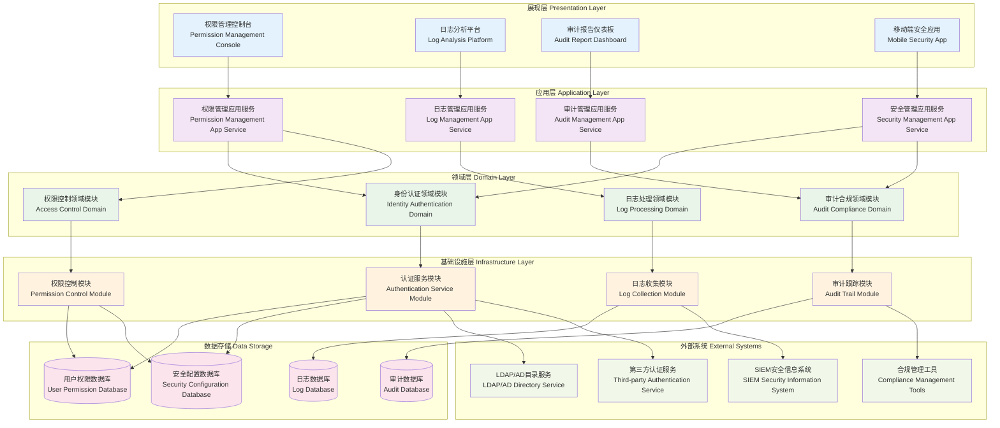

# 24.2.9 日志与权限建设功能架构图

## 技术架构概述
日志与权限建设功能为数字人产品提供完善的日志管理和权限控制体系，确保系统操作的可追溯性、安全性和合规性，支持精细化的权限管理和全面的审计能力。

## 模块化分层架构图



## 核心组件说明

### 1. 权限控制引擎 (Permission Control Engine)
- **功能**: 统一的权限控制和访问决策
- **特性**:
  - RBAC权限模型
  - ABAC属性访问控制
  - 细粒度权限控制
  - 动态权限评估

### 2. 日志收集器 (Log Collector)
- **功能**: 全方位收集系统和业务日志
- **特性**:
  - 多源日志收集
  - 实时日志传输
  - 日志格式标准化
  - 高可用收集架构

### 3. 操作审计系统 (Operation Audit System)
- **功能**: 记录和追踪所有关键操作
- **特性**:
  - 完整操作链路追踪
  - 敏感操作监控
  - 异常行为检测
  - 审计报告生成

### 4. 身份认证服务 (Authentication Service)
- **功能**: 提供安全的身份认证能力
- **特性**:
  - 多种认证方式
  - 密码策略管理
  - 会话管理
  - 认证日志记录

## 权限管理体系

### 1. RBAC权限模型
```yaml
rbac_model:
  users:
    - user_id: "user001"
      username: "admin"
      roles: ["system_admin", "audit_viewer"]
  
  roles:
    - role_id: "system_admin"
      role_name: "系统管理员"
      permissions: ["user_manage", "system_config", "log_view"]
    
    - role_id: "audit_viewer"
      role_name: "审计查看员"
      permissions: ["audit_view", "report_generate"]
  
  permissions:
    - permission_id: "user_manage"
      resource: "user"
      actions: ["create", "read", "update", "delete"]
    
    - permission_id: "log_view"
      resource: "log"
      actions: ["read", "search", "export"]
```

### 2. 权限控制策略
```python
class PermissionChecker:
    def __init__(self):
        self.policies = {}
    
    def check_permission(self, user, resource, action):
        # 获取用户角色
        user_roles = self.get_user_roles(user)
        
        # 检查角色权限
        for role in user_roles:
            if self.has_permission(role, resource, action):
                return True
        
        # 检查特殊权限
        return self.check_special_permission(user, resource, action)
    
    def has_permission(self, role, resource, action):
        role_permissions = self.get_role_permissions(role)
        return any(
            perm.resource == resource and action in perm.actions
            for perm in role_permissions
        )
```

### 3. 动态权限控制
- **时间限制**: 权限有效期控制
- **IP限制**: 基于IP地址的访问控制
- **设备限制**: 设备指纹识别和控制
- **行为分析**: 基于行为模式的动态权限调整

## 日志管理体系

### 1. 日志分类体系
```yaml
log_categories:
  system_logs:
    - application_log: "应用程序日志"
    - error_log: "错误日志"
    - performance_log: "性能日志"
    - security_log: "安全日志"
  
  business_logs:
    - user_operation: "用户操作日志"
    - transaction_log: "交易日志"
    - service_call: "服务调用日志"
    - data_change: "数据变更日志"
  
  audit_logs:
    - login_logout: "登录登出日志"
    - permission_change: "权限变更日志"
    - config_change: "配置变更日志"
    - sensitive_operation: "敏感操作日志"
```

### 2. 日志格式标准
```json
{
  "timestamp": "2024-01-15T10:30:00.000Z",
  "level": "INFO",
  "service": "digital-human-service",
  "trace_id": "abc123def456",
  "user_id": "user001",
  "session_id": "session123",
  "operation": "user_login",
  "resource": "authentication",
  "result": "success",
  "ip_address": "192.168.1.100",
  "user_agent": "Mozilla/5.0...",
  "details": {
    "login_method": "password",
    "device_info": "desktop"
  }
}
```

### 3. 日志处理流程
```
日志生成 → 格式化 → 收集聚合 → 存储索引 → 分析告警 → 归档清理
```

## 审计合规体系

### 1. 合规要求对接
- **GDPR合规**: 欧盟数据保护法规
- **SOX合规**: 萨班斯-奥克斯利法案
- **ISO 27001**: 信息安全管理体系
- **等保三级**: 国家信息安全等级保护

### 2. 审计追踪能力
```python
class AuditTrail:
    def __init__(self):
        self.audit_logger = AuditLogger()
    
    def record_operation(self, user_id, operation, resource, details):
        audit_record = {
            'timestamp': datetime.utcnow(),
            'user_id': user_id,
            'operation': operation,
            'resource': resource,
            'details': details,
            'ip_address': self.get_client_ip(),
            'session_id': self.get_session_id()
        }
        
        self.audit_logger.log(audit_record)
        
        # 敏感操作实时告警
        if self.is_sensitive_operation(operation):
            self.send_alert(audit_record)
```

### 3. 风险评估机制
- **异常行为检测**: 基于机器学习的异常检测
- **风险评分**: 操作风险量化评分
- **实时预警**: 高风险操作实时预警
- **趋势分析**: 安全风险趋势分析

## 安全防护机制

### 1. 多因子认证
```yaml
mfa_config:
  methods:
    - sms: "短信验证码"
    - email: "邮箱验证码"
    - totp: "时间令牌"
    - biometric: "生物特征"
  
  policies:
    - high_privilege_required: true
    - sensitive_operation_required: true
    - new_device_required: true
```

### 2. 会话管理
```python
class SessionManager:
    def __init__(self):
        self.sessions = {}
        self.session_timeout = 3600  # 1小时
    
    def create_session(self, user_id, login_info):
        session_id = self.generate_session_id()
        session = {
            'user_id': user_id,
            'created_at': time.time(),
            'last_activity': time.time(),
            'ip_address': login_info.get('ip_address'),
            'user_agent': login_info.get('user_agent')
        }
        
        self.sessions[session_id] = session
        return session_id
    
    def validate_session(self, session_id):
        if session_id not in self.sessions:
            return False
        
        session = self.sessions[session_id]
        if time.time() - session['last_activity'] > self.session_timeout:
            self.invalidate_session(session_id)
            return False
        
        session['last_activity'] = time.time()
        return True
```

### 3. 安全策略配置
```yaml
security_policies:
  password_policy:
    min_length: 8
    require_uppercase: true
    require_lowercase: true
    require_numbers: true
    require_special_chars: true
    max_age_days: 90
  
  account_lockout:
    max_failed_attempts: 5
    lockout_duration_minutes: 30
    reset_counter_minutes: 15
  
  session_policy:
    max_concurrent_sessions: 3
    idle_timeout_minutes: 60
    absolute_timeout_hours: 8
```

## 日志分析与监控

### 1. 实时监控指标
```yaml
monitoring_metrics:
  authentication:
    - login_success_rate: "> 95%"
    - login_failure_rate: "< 5%"
    - account_lockout_rate: "< 1%"
  
  authorization:
    - permission_check_latency: "< 10ms"
    - unauthorized_access_attempts: "< 10/hour"
  
  audit:
    - log_collection_rate: "> 99.9%"
    - audit_trail_completeness: "100%"
```

### 2. 异常检测算法
```python
class AnomalyDetector:
    def __init__(self):
        self.baseline_models = {}
    
    def detect_login_anomaly(self, user_id, login_info):
        # 检测异常登录时间
        if self.is_unusual_login_time(user_id, login_info['timestamp']):
            return True
        
        # 检测异常登录地点
        if self.is_unusual_location(user_id, login_info['ip_address']):
            return True
        
        # 检测异常设备
        if self.is_new_device(user_id, login_info['user_agent']):
            return True
        
        return False
```

### 3. 智能告警机制
- **分级告警**: 根据风险等级分级告警
- **告警聚合**: 相似告警聚合减少噪音
- **自动处理**: 低风险告警自动处理
- **升级机制**: 高风险告警自动升级

## 数据保护与隐私

### 1. 数据脱敏
```python
class DataMasker:
    def __init__(self):
        self.masking_rules = {
            'phone': self.mask_phone,
            'email': self.mask_email,
            'id_card': self.mask_id_card,
            'credit_card': self.mask_credit_card
        }
    
    def mask_sensitive_data(self, data, data_type):
        if data_type in self.masking_rules:
            return self.masking_rules[data_type](data)
        return data
    
    def mask_phone(self, phone):
        return phone[:3] + '****' + phone[-4:] if len(phone) >= 7 else phone
```

### 2. 数据加密
- **传输加密**: TLS/SSL加密传输
- **存储加密**: 敏感数据加密存储
- **字段级加密**: 关键字段单独加密
- **密钥管理**: 安全的密钥管理体系

### 3. 数据生命周期管理
```yaml
data_lifecycle:
  retention_policies:
    - log_type: "access_log"
      retention_period: "1_year"
      archive_after: "3_months"
    
    - log_type: "audit_log"
      retention_period: "7_years"
      archive_after: "1_year"
    
    - log_type: "error_log"
      retention_period: "6_months"
      archive_after: "1_month"
```

## 运维管理功能

### 1. 日志运维
- **日志轮转**: 自动日志文件轮转
- **存储管理**: 智能存储空间管理
- **性能优化**: 日志处理性能优化
- **故障恢复**: 日志系统故障恢复

### 2. 权限运维
- **批量操作**: 权限批量分配和回收
- **定期审查**: 权限定期审查和清理
- **临时授权**: 临时权限授权管理
- **权限同步**: 多系统权限同步

### 3. 合规运维
- **合规检查**: 自动化合规检查
- **报告生成**: 自动化合规报告
- **整改跟踪**: 合规问题整改跟踪
- **证据保全**: 审计证据保全管理