# 24.2.9 日志与权限建设功能架构图

## 技术架构概述
日志与权限建设功能采用零信任安全架构(ZTA)和实时审计技术，为数字人产品提供企业级的安全治理平台。系统支持实时权限控制、全量日志采集、智能威胁检测，实现权限检查<10ms、日志处理>100万条/秒。

### 核心价值
- **零信任安全**: 每次访问都要验证，永不信任
- **实时审计**: 毫秒级安全事件检测和响应
- **智能分析**: AI驱动的异常行为检测
- **合规保障**: 支持GDPR、SOX、ISO27001等标准

## 模块化分层架构图

```mermaid
graph TB
    subgraph "展现层 Presentation Layer"
        A[🔒 零信任权限中心<br/>Zero Trust Access Center<br/><small>React + Okta + Auth0</small>]
        B[🔍 智能日志分析平台<br/>Intelligent Log Analytics<br/><small>Vue 3 + Kibana + Grafana</small>]
        C[📊 实时审计仪表板<br/>Real-time Audit Dashboard<br/><small>Angular + Splunk + Tableau</small>]
        D[📱 移动端安全应用<br/>Mobile Security Suite<br/><small>Flutter + Biometric + MFA</small>]
    end
    
    subgraph "应用层 Application Layer"
        E[权限管理应用服务<br/>Permission Management App Service]
        F[日志管理应用服务<br/>Log Management App Service]
        G[审计管理应用服务<br/>Audit Management App Service]
        H[安全管理应用服务<br/>Security Management App Service]
    end
    
    subgraph "领域层 Domain Layer"
        I[身份认证领域模块<br/>Identity Authentication Domain]
        J[权限控制领域模块<br/>Access Control Domain]
        K[日志处理领域模块<br/>Log Processing Domain]
        L[审计合规领域模块<br/>Audit Compliance Domain]
    end
    
    subgraph "基础设施层 Infrastructure Layer"
        M[认证服务模块<br/>Authentication Service Module]
        N[权限控制模块<br/>Permission Control Module]
        O[日志收集模块<br/>Log Collection Module]
        P[审计跟踪模块<br/>Audit Trail Module]
    end
    
    subgraph "数据存储 Data Storage"
        Q[(用户权限数据库<br/>User Permission Database)]
        R[(日志数据库<br/>Log Database)]
        S[(审计数据库<br/>Audit Database)]
        T[(安全配置数据库<br/>Security Configuration Database)]
    end
    
    subgraph "外部系统 External Systems"
        U[LDAP/AD目录服务<br/>LDAP/AD Directory Service]
        V[第三方认证服务<br/>Third-party Authentication Service]
        W[SIEM安全信息系统<br/>SIEM Security Information System]
        X[合规管理工具<br/>Compliance Management Tools]
    end
    
    %% 展现层到应用层
    A --> E
    B --> F
    C --> G
    D --> H
    
    %% 应用层到领域层
    E --> I
    E --> J
    F --> K
    G --> L
    H --> I
    H --> L
    
    %% 领域层到基础设施层
    I --> M
    J --> N
    K --> O
    L --> P
    
    %% 基础设施层到数据存储
    M --> Q
    N --> Q
    O --> R
    P --> S
    M --> T
    N --> T
    
    %% 基础设施层到外部系统
    M --> U
    M --> V
    O --> W
    P --> X
    
    %% 样式定义
    style A fill:#E3F2FD
    style B fill:#E3F2FD
    style C fill:#E3F2FD
    style D fill:#E3F2FD
    style E fill:#F3E5F5
    style F fill:#F3E5F5
    style G fill:#F3E5F5
    style H fill:#F3E5F5
    style I fill:#E8F5E8
    style J fill:#E8F5E8
    style K fill:#E8F5E8
    style L fill:#E8F5E8
    style M fill:#FFF3E0
    style N fill:#FFF3E0
    style O fill:#FFF3E0
    style P fill:#FFF3E0
    style Q fill:#FCE4EC
    style R fill:#FCE4EC
    style S fill:#FCE4EC
    style T fill:#FCE4EC
    style U fill:#F1F8E9
    style V fill:#F1F8E9
    style W fill:#F1F8E9
    style X fill:#F1F8E9
```



## 核心组件说明

### 1. 权限控制引擎 (Permission Control Engine)
- **功能**: 统一的权限控制和访问决策
- **特性**:
  - RBAC权限模型
  - ABAC属性访问控制
  - 细粒度权限控制
  - 动态权限评估

### 2. 日志收集器 (Log Collector)
- **功能**: 全方位收集系统和业务日志
- **特性**:
  - 多源日志收集
  - 实时日志传输
  - 日志格式标准化
  - 高可用收集架构

### 3. 操作审计系统 (Operation Audit System)
- **功能**: 记录和追踪所有关键操作
- **特性**:
  - 完整操作链路追踪
  - 敏感操作监控
  - 异常行为检测
  - 审计报告生成

### 4. 身份认证服务 (Authentication Service)
- **功能**: 提供安全的身份认证能力
- **特性**:
  - 多种认证方式
  - 密码策略管理
  - 会话管理
  - 认证日志记录

## 权限管理体系

### 1. RBAC权限模型
```yaml
rbac_model:
  users:
    - user_id: "user001"
      username: "admin"
      roles: ["system_admin", "audit_viewer"]
  
  roles:
    - role_id: "system_admin"
      role_name: "系统管理员"
      permissions: ["user_manage", "system_config", "log_view"]
    
    - role_id: "audit_viewer"
      role_name: "审计查看员"
      permissions: ["audit_view", "report_generate"]
  
  permissions:
    - permission_id: "user_manage"
      resource: "user"
      actions: ["create", "read", "update", "delete"]
    
    - permission_id: "log_view"
      resource: "log"
      actions: ["read", "search", "export"]
```

### 2. 权限控制策略
```python
class PermissionChecker:
    def __init__(self):
        self.policies = {}
    
    def check_permission(self, user, resource, action):
        # 获取用户角色
        user_roles = self.get_user_roles(user)
        
        # 检查角色权限
        for role in user_roles:
            if self.has_permission(role, resource, action):
                return True
        
        # 检查特殊权限
        return self.check_special_permission(user, resource, action)
    
    def has_permission(self, role, resource, action):
        role_permissions = self.get_role_permissions(role)
        return any(
            perm.resource == resource and action in perm.actions
            for perm in role_permissions
        )
```

### 3. 动态权限控制
- **时间限制**: 权限有效期控制
- **IP限制**: 基于IP地址的访问控制
- **设备限制**: 设备指纹识别和控制
- **行为分析**: 基于行为模式的动态权限调整

## 日志管理体系

### 1. 日志分类体系
```yaml
log_categories:
  system_logs:
    - application_log: "应用程序日志"
    - error_log: "错误日志"
    - performance_log: "性能日志"
    - security_log: "安全日志"
  
  business_logs:
    - user_operation: "用户操作日志"
    - transaction_log: "交易日志"
    - service_call: "服务调用日志"
    - data_change: "数据变更日志"
  
  audit_logs:
    - login_logout: "登录登出日志"
    - permission_change: "权限变更日志"
    - config_change: "配置变更日志"
    - sensitive_operation: "敏感操作日志"
```

### 2. 日志格式标准
```json
{
  "timestamp": "2024-01-15T10:30:00.000Z",
  "level": "INFO",
  "service": "digital-human-service",
  "trace_id": "abc123def456",
  "user_id": "user001",
  "session_id": "session123",
  "operation": "user_login",
  "resource": "authentication",
  "result": "success",
  "ip_address": "192.168.1.100",
  "user_agent": "Mozilla/5.0...",
  "details": {
    "login_method": "password",
    "device_info": "desktop"
  }
}
```

### 3. 日志处理流程
```
日志生成 → 格式化 → 收集聚合 → 存储索引 → 分析告警 → 归档清理
```

## 审计合规体系

### 1. 合规要求对接
- **GDPR合规**: 欧盟数据保护法规
- **SOX合规**: 萨班斯-奥克斯利法案
- **ISO 27001**: 信息安全管理体系
- **等保三级**: 国家信息安全等级保护

### 2. 审计追踪能力
```python
class AuditTrail:
    def __init__(self):
        self.audit_logger = AuditLogger()
    
    def record_operation(self, user_id, operation, resource, details):
        audit_record = {
            'timestamp': datetime.utcnow(),
            'user_id': user_id,
            'operation': operation,
            'resource': resource,
            'details': details,
            'ip_address': self.get_client_ip(),
            'session_id': self.get_session_id()
        }
        
        self.audit_logger.log(audit_record)
        
        # 敏感操作实时告警
        if self.is_sensitive_operation(operation):
            self.send_alert(audit_record)
```

### 3. 风险评估机制
- **异常行为检测**: 基于机器学习的异常检测
- **风险评分**: 操作风险量化评分
- **实时预警**: 高风险操作实时预警
- **趋势分析**: 安全风险趋势分析

## 安全防护机制

### 1. 多因子认证
```yaml
mfa_config:
  methods:
    - sms: "短信验证码"
    - email: "邮箱验证码"
    - totp: "时间令牌"
    - biometric: "生物特征"
  
  policies:
    - high_privilege_required: true
    - sensitive_operation_required: true
    - new_device_required: true
```

### 2. 会话管理
```python
class SessionManager:
    def __init__(self):
        self.sessions = {}
        self.session_timeout = 3600  # 1小时
    
    def create_session(self, user_id, login_info):
        session_id = self.generate_session_id()
        session = {
            'user_id': user_id,
            'created_at': time.time(),
            'last_activity': time.time(),
            'ip_address': login_info.get('ip_address'),
            'user_agent': login_info.get('user_agent')
        }
        
        self.sessions[session_id] = session
        return session_id
    
    def validate_session(self, session_id):
        if session_id not in self.sessions:
            return False
        
        session = self.sessions[session_id]
        if time.time() - session['last_activity'] > self.session_timeout:
            self.invalidate_session(session_id)
            return False
        
        session['last_activity'] = time.time()
        return True
```

### 3. 安全策略配置
```yaml
security_policies:
  password_policy:
    min_length: 8
    require_uppercase: true
    require_lowercase: true
    require_numbers: true
    require_special_chars: true
    max_age_days: 90
  
  account_lockout:
    max_failed_attempts: 5
    lockout_duration_minutes: 30
    reset_counter_minutes: 15
  
  session_policy:
    max_concurrent_sessions: 3
    idle_timeout_minutes: 60
    absolute_timeout_hours: 8
```

## 日志分析与监控

### 1. 实时监控指标
```yaml
monitoring_metrics:
  authentication:
    - login_success_rate: "> 95%"
    - login_failure_rate: "< 5%"
    - account_lockout_rate: "< 1%"
  
  authorization:
    - permission_check_latency: "< 10ms"
    - unauthorized_access_attempts: "< 10/hour"
  
  audit:
    - log_collection_rate: "> 99.9%"
    - audit_trail_completeness: "100%"
```

### 2. 异常检测算法
```python
class AnomalyDetector:
    def __init__(self):
        self.baseline_models = {}
    
    def detect_login_anomaly(self, user_id, login_info):
        # 检测异常登录时间
        if self.is_unusual_login_time(user_id, login_info['timestamp']):
            return True
        
        # 检测异常登录地点
        if self.is_unusual_location(user_id, login_info['ip_address']):
            return True
        
        # 检测异常设备
        if self.is_new_device(user_id, login_info['user_agent']):
            return True
        
        return False
```

### 3. 智能告警机制
- **分级告警**: 根据风险等级分级告警
- **告警聚合**: 相似告警聚合减少噪音
- **自动处理**: 低风险告警自动处理
- **升级机制**: 高风险告警自动升级

## 数据保护与隐私

### 1. 数据脱敏
```python
class DataMasker:
    def __init__(self):
        self.masking_rules = {
            'phone': self.mask_phone,
            'email': self.mask_email,
            'id_card': self.mask_id_card,
            'credit_card': self.mask_credit_card
        }
    
    def mask_sensitive_data(self, data, data_type):
        if data_type in self.masking_rules:
            return self.masking_rules[data_type](data)
        return data
    
    def mask_phone(self, phone):
        return phone[:3] + '****' + phone[-4:] if len(phone) >= 7 else phone
```

### 2. 数据加密
- **传输加密**: TLS/SSL加密传输
- **存储加密**: 敏感数据加密存储
- **字段级加密**: 关键字段单独加密
- **密钥管理**: 安全的密钥管理体系

### 3. 数据生命周期管理
```yaml
data_lifecycle:
  retention_policies:
    - log_type: "access_log"
      retention_period: "1_year"
      archive_after: "3_months"
    
    - log_type: "audit_log"
      retention_period: "7_years"
      archive_after: "1_year"
    
    - log_type: "error_log"
      retention_period: "6_months"
      archive_after: "1_month"
```

## 运维管理功能

### 1. 日志运维
- **日志轮转**: 自动日志文件轮转
- **存储管理**: 智能存储空间管理
- **性能优化**: 日志处理性能优化
- **故障恢复**: 日志系统故障恢复

### 2. 权限运维
- **批量操作**: 权限批量分配和回收
- **定期审查**: 权限定期审查和清理
- **临时授权**: 临时权限授权管理
- **权限同步**: 多系统权限同步

### 3. 合规运维
- **合规检查**: 自动化合规检查
- **报告生成**: 自动化合规报告
- **整改跟踪**: 合规问题整改跟踪
- **证据保全**: 审计证据保全管理